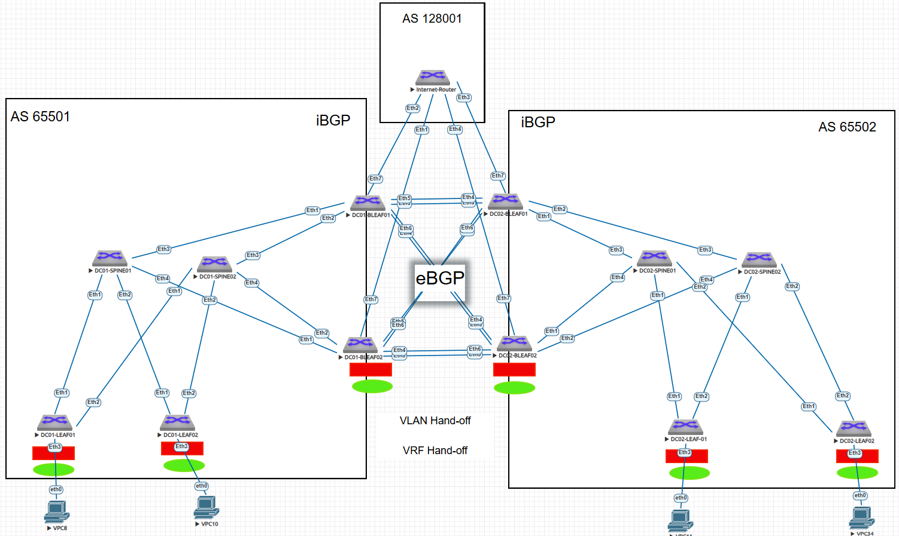

# VXLAN-Multifabric

### Цель:
Настроить две независимые VXLAN фабрики с использованием протокола iBGP
Обьединить две фабрики по технологии Multifabric (VLAN Hand-off, VRF Hand-off)
как наиболее распостраненное решение у отечественных вендоров

### Адресное пространство

|DC #    |#SPINE  |Тип адреса|Hostname устройства|Устройство/Устройства     |имя интерфейса|IP адрес      |Comments |
|--------|--------|----------|-------------------|--------------------------|--------------|--------------|---------|
|DC#1    |SPINE01 |loopback  |dc01-spine01#      |SPINE01                   |loopback 1    |10.11.1.1/32  |         |
|DC#1    |SPINE02 |loopback  |dc01-spine02#      |SPINE02                   |loopback 1    |10.11.1.2/32  |         |
|DC#1    |LEAF01  |loopback  |dc01-leaf01#       |LEAF01                    |loopback 1    |10.11.1.3/32  |         |
|DC#1    |LEAF02  |loopback  |dc01-leaf02#       |LEAF02                    |loopback 1    |10.11.1.4/32  |         |
|DC#1    |BLEAF01 |loopback  |dc01-bleaf01#      |BLEAF01                   |loopback 1    |10.11.1.5/32  |         |
|DC#1    |BLEAF02 |loopback  |dc01-bleaf02#      |BLEAF02                   |loopback 1    |10.11.1.6/32  |         |
|DC#2    |SPINE01 |loopback  |dc02-spine01#      |SPINE01                   |loopback 1    |10.11.1.7/32  |         |
|DC#2    |SPINE02 |loopback  |dc02-spine02#      |SPINE02                   |loopback 1    |10.11.1.8/32  |         |
|DC#2    |LEAF01  |loopback  |dc02-leaf01#       |LEAF01                    |loopback 1    |10.11.1.9/32  |         |
|DC#2    |LEAF02  |loopback  |dc02-leaf02#       |LEAF02                    |loopback 1    |10.11.1.10/32 |         |
|DC#2    |BLEAF01 |loopback  |dc02-bleaf01#      |BLEAF01                   |loopback 1    |10.11.1.11/32 |         |
|DC#2    |BLEAF02 |loopback  |dc02-bleaf02#      |BLEAF02                   |loopback 1    |10.11.1.12/32 |         |
|Internet|Internet|loopback  |Internet           |Internet                  |loopback 1    |10.11.1.250/32|         |
|резерв  |резерв  |резерв    |резерв             |резерв                    |              |10.11.1.0/25  |         |
|DC#1    |SPINE01 |loopback  |dc01-spine01#      |SPINE01                   |loopback 2    |10.11.2.1/32  |         |
|DC#1    |SPINE02 |loopback  |dc01-spine02#      |SPINE02                   |loopback 2    |10.11.2.2/32  |         |
|DC#1    |LEAF01  |loopback  |dc01-leaf01#       |LEAF01                    |loopback 2    |10.11.2.3/32  |         |
|DC#1    |LEAF02  |loopback  |dc01-leaf02#       |LEAF02                    |loopback 2    |10.11.2.4/32  |         |
|DC#1    |BLEAF01 |loopback  |dc01-bleaf01#      |BLEAF01                   |loopback 2    |10.11.2.5/32  |         |
|DC#1    |BLEAF02 |loopback  |dc01-bleaf02#      |BLEAF02                   |loopback 2    |10.11.2.6/32  |         |
|DC#2    |SPINE01 |loopback  |dc02-spine01#      |SPINE01                   |loopback 2    |10.11.2.128/32|         |
|DC#2    |SPINE02 |loopback  |dc02-spine02#      |SPINE02                   |loopback 2    |10.11.2.129/32|         |
|DC#2    |LEAF01  |loopback  |dc02-leaf01#       |LEAF01                    |loopback 2    |10.11.2.130/32|         |
|DC#2    |LEAF02  |loopback  |dc02-leaf02#       |LEAF02                    |loopback 2    |10.11.2.131/32|         |
|DC#2    |BLEAF01 |loopback  |dc02-bleaf01#      |BLEAF01                   |loopback 2    |10.11.2.132/32|         |
|DC#2    |BLEAF02 |loopback  |dc02-bleaf02#      |BLEAF02                   |loopback 2    |10.11.2.133/32|         |
|резерв  |резерв  |резерв    |резерв             |резерв                    |резерв        |10.11.2.0/24  |         |
|DC#1    |SPINE01 |PtP_link  |dc01-spine01#      |SPINE01->LEAF01           |eth 1         |10.11.3.0/31  |         |
|DC#1    |SPINE01 |PtP_link  |dc01-spine01#      |SPINE01->LEAF02           |eth 2         |10.11.3.2/31  |         |
|DC#1    |SPINE01 |PtP_link  |dc01-spine01#      |SPINE01->BLEAF01          |eth 3         |10.11.3.4/31  |         |
|DC#1    |SPINE01 |PtP_link  |dc01-spine01#      |SPINE01->BLEAF02          |eth 4         |10.11.3.6/31  |         |
|DC#1    |SPINE02 |PtP_link  |dc01-spine02#      |SPINE02->LEAF01           |eth 5         |10.11.3.8/31  |         |
|DC#1    |SPINE02 |PtP_link  |dc01-spine02#      |SPINE02->LEAF02           |eth 6         |10.11.3.10/31 |         |
|DC#1    |SPINE02 |PtP_link  |dc01-spine02#      |SPINE02->BLEAF01          |eth 7         |10.11.3.12/31 |         |
|DC#1    |SPINE02 |PtP_link  |dc01-spine02#      |SPINE02->BLEAF02          |eth 8         |10.11.3.14/31 |         |
|DC#2    |SPINE01 |PtP_link  |dc02-spine01#      |SPINE01->LEAF01           |eth 1         |10.11.3.0/31  |         |
|DC#2    |SPINE01 |PtP_link  |dc02-spine01#      |SPINE01->LEAF02           |eth 2         |10.11.3.2/31  |         |
|DC#2    |SPINE01 |PtP_link  |dc02-spine01#      |SPINE01->BLEAF01          |eth 3         |10.11.3.4/31  |         |
|DC#2    |SPINE01 |PtP_link  |dc02-spine01#      |SPINE01->BLEAF02          |eth 4         |10.11.3.6/31  |         |
|DC#2    |SPINE02 |PtP_link  |dc02-spine02#      |SPINE02->LEAF01           |eth 5         |10.11.3.8/31  |         |
|DC#2    |SPINE02 |PtP_link  |dc02-spine02#      |SPINE02->LEAF02           |eth 6         |10.11.3.10/31 |         |
|DC#2    |SPINE02 |PtP_link  |dc02-spine02#      |SPINE02->BLEAF01          |eth 7         |10.11.3.12/31 |         |
|DC#2    |SPINE02 |PtP_link  |dc02-spine02#      |SPINE02->BLEAF02          |eth 8         |10.11.3.14/31 |         |
|DCI     |BLEAF01 |PtP_link  |dc01-pod01-bleaf01#|DC01-BLEAF01->DC02-BLEAF01|              |10.11.4.0/31  |vrf RED  |
|DCI     |BLEAF01 |PtP_link  |dc01-pod01-bleaf01#|DC01-BLEAF01->DC02-BLEAF02|              |10.11.4.2/31  |vrf RED  |
|DCI     |BLEAF02 |PtP_link  |dc01-pod01-bleaf02#|DC01-BLEAF02->DC02-BLEAF01|              |10.11.4.4/31  |vrf RED  |
|DCI     |BLEAF02 |PtP_link  |dc01-pod01-bleaf02#|DC01-BLEAF02->DC02-BLEAF02|              |10.11.4.6/31  |vrf RED  |
|DCI     |BLEAF01 |PtP_link  |dc01-pod01-bleaf01#|DC01-BLEAF01->DC02-BLEAF01|              |10.11.4.8/31  |VRF GREEN|
|DCI     |BLEAF01 |PtP_link  |dc01-pod01-bleaf01#|DC01-BLEAF01->DC02-BLEAF02|              |10.11.4.10/31 |VRF GREEN|
|DCI     |BLEAF02 |PtP_link  |dc01-pod01-bleaf02#|DC01-BLEAF02->DC02-BLEAF01|              |10.11.4.12/31 |VRF GREEN|
|DCI     |BLEAF02 |PtP_link  |dc01-pod01-bleaf02#|DC01-BLEAF02->DC02-BLEAF02|              |10.11.4.14/31 |VRF GREEN|
|Internet|Internet|PtP_link  |DC01-BLEAF01#      |DC01-BLEAF01->Internet    |              |10.11.5.0/31  |VRF RED  |
|Internet|Internet|PtP_link  |DC01-BLEAF02#      |DC01-BLEAF02->Internet    |              |10.11.5.2/31  |VRF RED  |
|Internet|Internet|PtP_link  |DC02-BLEAF01#      |DC02-BLEAF01->Internet    |              |10.11.5.4/31  |VRF RED  |
|        |        |          |DC02-BLEAF02#      |DC02-BLEAF02->Internet    |              |10.11.5.6/31  |VRF RED  |
|Internet|Internet|PtP_link  |DC01-BLEAF01#      |DC01-BLEAF01->Internet    |              |10.11.6.0/31  |VRF GREEN|
|Internet|Internet|PtP_link  |DC01-BLEAF02#      |DC01-BLEAF02->Internet    |              |10.11.6.2/31  |VRF GREEN|
|        |        |          |DC02-BLEAF01#      |DC02-BLEAF01->Internet    |              |10.11.6.4/31  |VRF GREEN|
|Internet|Internet|PtP_link  |DC02-BLEAF02#      |DC02-BLEAF02->Internet    |              |10.11.6.6/31  |VRF GREEN|
|DCI     |SPINE02 |L2        |dc01-pod01-spine02#|DC01-BLEAF01->DC02-BLEAF01|              |L2            |         |
|DCI     |SPINE02 |L2        |dc01-pod01-spine02#|DC01-BLEAF01->DC02-BLEAF02|              |L2            |         |
|DCI     |SPINE02 |L2        |dc01-pod01-spine02#|DC01-BLEAF02->DC02-BLEAF01|              |L2            |         |
|DCI     |SPINE02 |L2        |dc01-pod01-spine02#|DC01-BLEAF02->DC02-BLEAF02|              |L2            |         |


### Итоговая схема


## Конфигурации устройств в DataCenter1 (DC01):

<details>
  <summary> dc01-spine01 </summary>

```
dc01-spine01#show running-config
! Command: show running-config
! device: dc01-spine01 (vEOS-lab, EOS-4.29.2F)
!
! boot system flash:/vEOS-lab.swi
!
no aaa root
!
transceiver qsfp default-mode 4x10G
!
service routing protocols model multi-agent
!
hostname dc01-spine01
!
spanning-tree mode mstp
!
interface Ethernet1
   description =LINK-TO_LEAF01=
   no switchport
   ip address 10.11.3.0/31
!
interface Ethernet2
   description =LINK-TO_LEAF02=
   no switchport
   ip address 10.11.3.2/31
!
interface Ethernet3
   description =LINK_TO_BLEAF01=
   no switchport
   ip address 10.11.3.4/31
!
interface Ethernet4
   description =LINK-TO_BLEAF02=
   no switchport
   ip address 10.11.3.6/31
!
interface Ethernet5
!
interface Ethernet6
!
interface Ethernet7
!
interface Ethernet8
!
interface Loopback1
   ip address 10.11.1.1/32
!
interface Loopback2
   ip address 10.11.2.1/32
!
interface Management1
   ip address 172.16.0.254/24
!
ip routing
!
ip prefix-list PL_1
   seq 10 permit 10.11.1.0/24 le 32
   seq 20 permit 10.11.3.0/24 le 32
!
route-map MAP_1 permit 10
   match ip address prefix-list PL_1
!
router bgp 65501
   router-id 10.11.1.1
   graceful-restart restart-time 300
   maximum-paths 6 ecmp 64
   neighbor EVPN peer group
   neighbor EVPN remote-as 65501
   neighbor EVPN update-source Loopback1
   neighbor EVPN route-reflector-client
   neighbor EVPN route-reflector cluster-id 10.11.1.1
   neighbor EVPN password 7 FvNSlY/ujVE=
   neighbor EVPN send-community extended
   neighbor underlay_ibgp peer group
   neighbor underlay_ibgp remote-as 65501
   neighbor underlay_ibgp next-hop-self
   neighbor underlay_ibgp route-reflector-client
   neighbor underlay_ibgp route-reflector cluster-id 10.11.1.1
   neighbor underlay_ibgp route-map MAP_1 in
   neighbor underlay_ibgp password 7 e620vg94KQ0=
   neighbor underlay_ibgp maximum-routes 12000 warning-only
   neighbor 10.11.1.3 peer group EVPN
   neighbor 10.11.1.3 description LEAF01_Lo1
   neighbor 10.11.1.4 peer group EVPN
   neighbor 10.11.1.4 description LEAF02_Lo1
   neighbor 10.11.1.5 peer group EVPN
   neighbor 10.11.1.5 description BLEAF01_Lo1
   neighbor 10.11.1.6 peer group EVPN
   neighbor 10.11.1.6 description BLEAF02_Lo1
   neighbor 10.11.3.1 peer group underlay_ibgp
   neighbor 10.11.3.1 description LEAF01
   neighbor 10.11.3.3 peer group underlay_ibgp
   neighbor 10.11.3.3 description LEAF02
   neighbor 10.11.3.5 peer group underlay_ibgp
   neighbor 10.11.3.5 description BLEAF01
   neighbor 10.11.3.7 peer group underlay_ibgp
   neighbor 10.11.3.7 description BLEAF02
   !
   address-family evpn
      neighbor EVPN activate
   !
   address-family ipv4
      no neighbor EVPN activate
      neighbor underlay_ibgp activate
      network 10.11.1.1/32
      network 10.11.3.0/24
      graceful-restart
!
end

```
</details> 

<details>
  <summary>dc01-spine02 </summary>

```
dc01-spine02#show running-config
! Command: show running-config
! device: dc01-spine02 (vEOS-lab, EOS-4.29.2F)
!
! boot system flash:/vEOS-lab.swi
!
no aaa root
!
transceiver qsfp default-mode 4x10G
!
service routing protocols model multi-agent
!
hostname dc01-spine02
!
spanning-tree mode mstp
!
interface Ethernet1
   description =LINK-TO_LEAF01=
   no switchport
   ip address 10.11.3.8/31
!
interface Ethernet2
   description =LINK-TO_LEAF02=
   no switchport
   ip address 10.11.3.10/31
!
interface Ethernet3
   description =LINK_TO_BLEAF01=
   no switchport
   ip address 10.11.3.12/31
!
interface Ethernet4
   description =LINK-TO_BLEAF02=
   no switchport
   ip address 10.11.3.14/31
!
interface Ethernet5
!
interface Ethernet6
!
interface Ethernet7
!
interface Ethernet8
!
interface Loopback1
   ip address 10.11.1.2/32
!
interface Loopback2
   ip address 10.11.2.2/32
!
interface Management1
   ip address 172.16.0.253/24
!
ip routing
!
ip prefix-list PL_1
   seq 10 permit 10.11.1.0/24 le 32
   seq 20 permit 10.11.3.0/24 le 32
!
route-map MAP_1 permit 10
   match ip address prefix-list PL_1
!
router bgp 65501
   router-id 10.11.1.2
   graceful-restart restart-time 300
   maximum-paths 6 ecmp 64
   neighbor EVPN peer group
   neighbor EVPN remote-as 65501
   neighbor EVPN update-source Loopback1
   neighbor EVPN route-reflector-client
   neighbor EVPN route-reflector cluster-id 10.11.1.1
   neighbor EVPN password 7 FvNSlY/ujVE=
   neighbor EVPN send-community extended
   neighbor underlay_ibgp peer group
   neighbor underlay_ibgp remote-as 65501
   neighbor underlay_ibgp next-hop-self
   neighbor underlay_ibgp route-reflector-client
   neighbor underlay_ibgp route-reflector cluster-id 10.11.1.1
   neighbor underlay_ibgp route-map MAP_1 in
   neighbor underlay_ibgp password 7 e620vg94KQ0=
   neighbor underlay_ibgp maximum-routes 12000 warning-only
   neighbor 10.11.1.1 remote-as 65501
   neighbor 10.11.1.3 peer group EVPN
   neighbor 10.11.1.3 description LEAF01_Lo1
   neighbor 10.11.1.4 peer group EVPN
   neighbor 10.11.1.4 description LEAF02_Lo1
   neighbor 10.11.1.5 peer group EVPN
   neighbor 10.11.1.5 description BLEAF01_Lo1
   neighbor 10.11.1.6 peer group EVPN
   neighbor 10.11.1.6 description BLEAF02_Lo1
   neighbor 10.11.3.9 peer group underlay_ibgp
   neighbor 10.11.3.9 description LEAF01
   neighbor 10.11.3.11 peer group underlay_ibgp
   neighbor 10.11.3.11 description LEAF02
   neighbor 10.11.3.13 peer group underlay_ibgp
   neighbor 10.11.3.13 description BLEAF01
   neighbor 10.11.3.15 peer group underlay_ibgp
   neighbor 10.11.3.15 description BLEAF02
   !
   address-family evpn
      neighbor EVPN activate
   !
   address-family ipv4
      no neighbor EVPN activate
      neighbor underlay_ibgp activate
      network 10.11.1.2/32
      network 10.11.3.0/24
      graceful-restart
!
end
```
</details> 

<details>
  <summary>dc01-leaf01 </summary>

```
dc01-leaf01#show running-config
! Command: show running-config
! device: dc01-leaf01 (vEOS-lab, EOS-4.29.2F)
!
! boot system flash:/vEOS-lab.swi
!
no aaa root
!
transceiver qsfp default-mode 4x10G
!
service routing protocols model multi-agent
!
logging synchronous level critical
!
hostname dc01-leaf01
!
spanning-tree mode mstp
no spanning-tree vlan-id 4000-4001
!
vlan 101
   name =VLAN_101_RED=
!
vlan 102
   name =VLAN_102_RED=
!
vlan 201
   name =VLAN_201_GREEN=
!
vlan 202
   name =VLAN_202_GREEN=
!
vlan 333
   name CLIENTs
!
vrf instance GREEN
!
vrf instance RED
!
interface Port-Channel1
   description =For_Clients=
   switchport trunk allowed vlan 101-102,201-202,333
   switchport mode trunk
   !
   evpn ethernet-segment
      identifier 0000:babe:face:fade:bace
      route-target import ba:be:fa:ce:ba:ce
   lacp system-id fade.babe.face
!
interface Ethernet1
   description =LINK-TO_DC01-SPINE01=
   no switchport
   ip address 10.11.3.1/31
!
interface Ethernet2
   description =LINK-TO_DC01-SPINE02=
   no switchport
   ip address 10.11.3.9/31
!
interface Ethernet3
   switchport access vlan 101
!
interface Ethernet4
   switchport access vlan 101
   channel-group 1 mode active
!
interface Ethernet5
!
interface Ethernet6
!
interface Ethernet7
!
interface Ethernet8
!
interface Loopback1
   ip address 10.11.1.3/32
!
interface Loopback2
   ip address 10.11.2.3/32
!
interface Loopback3
   vrf RED
   ip address 1.1.1.0/32
!
interface Loopback4
   vrf GREEN
   ip address 3.3.3.0/32
!
interface Management1
   ip address 172.16.0.1/24
!
interface Vlan101
   vrf RED
   ip address 10.88.10.2/24
   ip virtual-router address 10.88.10.1/24
!
interface Vlan102
   vrf RED
   ip address 10.88.20.2/24
   ip virtual-router address 10.88.20.1/24
!
interface Vlan201
   vrf GREEN
   ip address 10.99.10.2/24
   ip virtual-router address 10.99.10.1/24
!
interface Vlan202
   vrf GREEN
   ip address 10.99.20.2/24
   ip virtual-router address 10.99.20.1/24
!
interface Vlan333
   ip address virtual 192.168.0.254/24
!
interface Vxlan1
   description =VXLAN=
   vxlan source-interface Loopback1
   vxlan udp-port 4789
   vxlan vlan 101 vni 100101
   vxlan vlan 102 vni 100102
   vxlan vlan 201 vni 100201
   vxlan vlan 202 vni 100202
   vxlan vlan 333 vni 100333
   vxlan vrf GREEN vni 1000200
   vxlan vrf RED vni 1000100
   vxlan learn-restrict any
!
ip virtual-router mac-address ba:be:ba:be:ba:be
!
ip routing
ip routing vrf GREEN
ip routing vrf RED
!
ip prefix-list PL_1
   seq 10 permit 10.11.1.0/24 le 32
   seq 20 permit 10.11.3.0/24 le 32
!
route-map MAP_1 permit 10
   match ip address prefix-list PL_1
!
router bgp 65501
   router-id 10.11.1.3
   graceful-restart restart-time 300
   maximum-paths 6 ecmp 64
   neighbor EVPN peer group
   neighbor EVPN remote-as 65501
   neighbor EVPN update-source Loopback1
   neighbor EVPN password 7 FvNSlY/ujVE=
   neighbor EVPN send-community extended
   neighbor underlay_ibgp peer group
   neighbor underlay_ibgp remote-as 65501
   neighbor underlay_ibgp route-map MAP_1 in
   neighbor underlay_ibgp password 7 e620vg94KQ0=
   neighbor underlay_ibgp maximum-routes 12000 warning-only
   neighbor 10.11.1.1 peer group EVPN
   neighbor 10.11.1.1 description SPINE01_Lo1
   neighbor 10.11.1.2 peer group EVPN
   neighbor 10.11.1.2 description SPINE02_Lo1
   neighbor 10.11.3.0 peer group underlay_ibgp
   neighbor 10.11.3.0 description SPINE01
   neighbor 10.11.3.8 peer group underlay_ibgp
   neighbor 10.11.3.8 description SPINE02
   redistribute connected
   redistribute attached-host
   !
   vlan 333
      rd 10.11.1.3:1
      route-target both 65501:333
      redistribute learned
      redistribute static
   !
   vlan-aware-bundle ESI LAG
      rd 10.11.1.3:100
      route-target both 65501:100
      redistribute learned
      vlan 101-102,201-202
   !
   address-family evpn
      neighbor EVPN activate
   !
   address-family ipv4
      no neighbor EVPN activate
      neighbor underlay_ibgp activate
      network 10.11.1.3/32
      network 10.11.2.3/32
      network 10.11.3.0/24
      graceful-restart
      redistribute connected
   !
   vrf GREEN
      rd 10.11.1.3:200
      route-target import evpn 65501:1000200
      route-target export evpn 65501:1000200
      redistribute connected
      redistribute attached-host
   !
   vrf RED
      rd 10.11.1.3:100
      route-target import evpn 65501:1000100
      route-target export evpn 65501:1000100
      redistribute connected
      redistribute attached-host
!
end
dc01-leaf01#
```
</details> 

<details>
  <summary>dc01-leaf02 </summary>

```
dc01-leaf02#show running-config
! Command: show running-config
! device: dc01-leaf02 (vEOS-lab, EOS-4.29.2F)
!
! boot system flash:/vEOS-lab.swi
!
no aaa root
!
transceiver qsfp default-mode 4x10G
!
service routing protocols model multi-agent
!
logging synchronous level critical
!
hostname dc01-leaf02
!
spanning-tree mode mstp
no spanning-tree vlan-id 4000-4001
!
vlan 101
   name =VLAN_101_RED=
!
vlan 102
   name =VLAN_102_RED=
!
vlan 201
   name =VLAN_201_GREEN=
!
vlan 202
   name =VLAN_202_GREEN=
!
vlan 333
   name Clients
!
vrf instance GREEN
!
vrf instance RED
!
interface Port-Channel1
   description =For_Clients=
   switchport trunk allowed vlan 101-102,201-202
   switchport mode trunk
   !
   evpn ethernet-segment
      identifier 0000:babe:face:fade:bace
      route-target import ba:be:fa:ce:ba:ce
   lacp system-id fade.babe.face
!
interface Ethernet1
   description =LINK-TO_DC01-SPINE01=
   no switchport
   ip address 10.11.3.3/31
!
interface Ethernet2
   description =LINK-TO_DC01-SPINE02=
   no switchport
   ip address 10.11.3.11/31
!
interface Ethernet3
   switchport access vlan 101
!
interface Ethernet4
   channel-group 1 mode active
!
interface Ethernet5
!
interface Ethernet6
!
interface Ethernet7
!
interface Ethernet8
!
interface Loopback1
   ip address 10.11.1.4/32
!
interface Loopback2
   ip address 10.11.2.4/32
!
interface Management1
   ip address 172.16.0.2/24
!
interface Vlan101
   vrf RED
   ip address 10.88.10.3/24
   ip virtual-router address 10.88.10.1/24
!
interface Vlan102
   vrf RED
   ip address 10.88.20.3/24
   ip virtual-router address 10.88.20.1/24
!
interface Vlan201
   vrf GREEN
   ip address 10.99.10.3/24
   ip virtual-router address 10.99.10.1/24
!
interface Vlan202
   vrf GREEN
   ip address 10.99.20.3/24
   ip virtual-router address 10.99.20.1/24
!
interface Vlan333
   ip address virtual 192.168.0.254/24
!
interface Vxlan1
   description =VXLAN=
   vxlan source-interface Loopback1
   vxlan udp-port 4789
   vxlan vlan 101 vni 100101
   vxlan vlan 102 vni 100102
   vxlan vlan 201 vni 100201
   vxlan vlan 202 vni 100202
   vxlan vlan 333 vni 100333
   vxlan vrf GREEN vni 1000200
   vxlan vrf RED vni 1000100
   vxlan learn-restrict any
!
ip virtual-router mac-address ba:be:ba:be:ba:be
!
ip routing
ip routing vrf GREEN
ip routing vrf RED
!
ip prefix-list PL_1
   seq 10 permit 10.11.1.0/24 le 32
   seq 20 permit 10.11.3.0/24 le 32
!
route-map MAP_1 permit 10
   match ip address prefix-list PL_1
!
router bgp 65501
   router-id 10.11.1.4
   graceful-restart restart-time 300
   maximum-paths 6 ecmp 64
   neighbor EVPN peer group
   neighbor EVPN remote-as 65501
   neighbor EVPN update-source Loopback1
   neighbor EVPN password 7 FvNSlY/ujVE=
   neighbor EVPN send-community extended
   neighbor EVPN2 peer group
   neighbor underlay_ibgp peer group
   neighbor underlay_ibgp remote-as 65501
   neighbor underlay_ibgp route-map MAP_1 in
   neighbor underlay_ibgp password 7 e620vg94KQ0=
   neighbor underlay_ibgp maximum-routes 12000 warning-only
   neighbor 10.11.1.1 peer group EVPN
   neighbor 10.11.1.1 description SPINE01_Lo1
   neighbor 10.11.1.2 peer group EVPN
   neighbor 10.11.1.2 description SPINE02_Lo1
   neighbor 10.11.3.2 peer group underlay_ibgp
   neighbor 10.11.3.2 description SPINE01
   neighbor 10.11.3.10 peer group underlay_ibgp
   neighbor 10.11.3.10 description SPINE02
   redistribute connected
   !
   vlan 333
      rd 10.11.1.4:1
      route-target both 65501:333
      redistribute learned
      redistribute static
   !
   vlan-aware-bundle ESI LAG
      rd 10.11.1.3:100
      route-target both 65501:100
      vlan 101-102,201-202
   !
   address-family evpn
      neighbor EVPN activate
      no neighbor EVPN2 activate
   !
   address-family ipv4
      no neighbor EVPN activate
      neighbor underlay_ibgp activate
      network 10.11.1.4/32
      network 10.11.2.4/32
      network 10.11.3.0/24
      graceful-restart
      redistribute connected
   !
   vrf GREEN
      rd 10.11.1.4:200
      route-target import evpn 65501:1000200
      route-target export evpn 65501:1000200
      redistribute connected
   !
   vrf RED
      rd 10.11.1.4:100
      route-target import evpn 65501:1000100
      route-target export evpn 65501:1000100
      redistribute connected
!
end
```
</details> 

<details>
  <summary> dc01-bleaf01 </summary>

```
dc01-bleaf01#show running-config
! Command: show running-config
! device: dc01-bleaf01 (vEOS-lab, EOS-4.29.2F)
!
! boot system flash:/vEOS-lab.swi
!
no aaa root
!
transceiver qsfp default-mode 4x10G
!
service routing protocols model multi-agent
!
logging synchronous level critical
!
hostname dc01-bleaf01
!
spanning-tree mode mstp
no spanning-tree vlan-id 4000-4001
!
vlan 101
   name =VLAN_101_RED=
!
vlan 102
   name =VLAN_102_RED=
!
vlan 201
   name =VLAN_201_GREEN=
!
vlan 202
   name =VLAN_202_GREEN=
!
vrf instance GREEN
!
vrf instance RED
!
interface Port-Channel1
!
interface Port-Channel10
   description =L2_DCI=
   switchport trunk allowed vlan 101-102,201-202,333
   switchport mode trunk
   !
   evpn ethernet-segment
      identifier 0000:babe:face:babe:face
      route-target import de:ad:00:00:de:ad
   lacp system-id dead.dead.dead
!
interface Ethernet1
   description =LINK-TO_DC01-SPINE01=
   mtu 9214
   no switchport
   ip address 10.11.3.5/31
!
interface Ethernet2
   description =LINK-TO_DC01-SPINE02=
   mtu 9214
   no switchport
   ip address 10.11.3.13/31
!
interface Ethernet3
   description =Link_to_dc02_BLEAF01=
   mtu 9214
   no switchport
   vrf RED
   ip address 10.11.4.0/31
!
interface Ethernet3.1
   description =Link_to_dc02_BLEAF01_vrf_GREEN=
   encapsulation dot1q vlan 300
   vrf GREEN
   ip address 10.11.4.8/31
!
interface Ethernet4
   description =Link_to_DC02-BLEAF02=
   mtu 9214
   channel-group 10 mode active
!
interface Ethernet5
   description =Link_to_DC02-BLEAF01=
   mtu 9214
   channel-group 10 mode active
!
interface Ethernet6
   description =Link_to_DC02_BLEAF02=
   mtu 9214
   no switchport
   vrf RED
   ip address 10.11.4.2/31
!
interface Ethernet6.1
   description =Link_to_DC02_BLEAF02_vrf_GREEN=
   encapsulation dot1q vlan 300
   vrf GREEN
   ip address 10.11.4.10/31
!
interface Ethernet7
   mtu 9214
   no switchport
!
interface Ethernet7.1
   description =Link_to_Internet_vrf_RED=
   encapsulation dot1q vlan 200
   vrf RED
   ip address 10.11.5.0/31
!
interface Ethernet7.2
   description =Link2_to_Internet_VRF_GREEN=
   encapsulation dot1q vlan 300
   vrf GREEN
   ip address 10.11.6.0/31
!
interface Ethernet8
   mtu 9214
!
interface Loopback1
   ip address 10.11.1.5/32
!
interface Loopback2
   ip address 10.11.2.5/32
!
interface Management1
   ip address 172.16.0.3/24
!
interface Vlan1
!
interface Vlan101
   vrf RED
   ip address 10.88.10.4/24
   ip virtual-router address 10.88.10.1/24
!
interface Vlan102
   vrf RED
   ip address 10.88.20.4/24
   ip virtual-router address 10.88.20.1/24
!
interface Vlan201
   vrf GREEN
   ip address 10.99.10.4/24
   ip virtual-router address 10.99.10.1/24
!
interface Vlan202
   vrf GREEN
   ip address 10.99.20.4/24
   ip virtual-router address 10.99.20.1/24
!
interface Vxlan1
   description =VXLAN=
   vxlan source-interface Loopback1
   vxlan udp-port 4789
   vxlan vlan 101 vni 100101
   vxlan vlan 102 vni 100102
   vxlan vlan 201 vni 100201
   vxlan vlan 202 vni 100202
   vxlan vrf GREEN vni 1000200
   vxlan vrf RED vni 1000100
   vxlan learn-restrict any
!
ip virtual-router mac-address ba:be:ba:be:ba:be
!
ip routing
ip routing vrf GREEN
ip routing vrf RED
!
ip prefix-list DC_list
   seq 10 permit 10.99.10.0/24 ge 24
   seq 20 permit 10.99.20.0/24 ge 24
   seq 30 permit 3.3.3.0/32 eq 32
   seq 40 permit 4.4.4.0/32 eq 32
!
ip prefix-list DC_list2
   seq 10 permit 10.88.10.0/24 ge 24
   seq 20 permit 10.88.20.0/24 ge 24
   seq 30 permit 1.1.1.0/32 eq 32
   seq 40 permit 2.2.2.0/32 eq 32
!
ip prefix-list PL_1
   seq 10 permit 10.11.1.0/24 ge 32
   seq 20 permit 10.11.3.0/24 ge 32
!
route-map MAP_1 permit 10
   match ip address prefix-list PL_1
!
route-map MAP_DC_out permit 10
   match ip address prefix-list DC_list
!
route-map MAP_DC_out2 permit 10
   match ip address prefix-list DC_list2
!
router bgp 65501
   router-id 10.11.1.5
   graceful-restart restart-time 300
   maximum-paths 6 ecmp 64
   neighbor DCI peer group
   neighbor DCI remote-as 65502
   neighbor DCI password 7 UN7cMARq+fc=
   neighbor EVPN peer group
   neighbor EVPN remote-as 65501
   neighbor EVPN update-source Loopback1
   neighbor EVPN password 7 FvNSlY/ujVE=
   neighbor EVPN send-community extended
   neighbor Internet peer group
   neighbor Internet remote-as 128001
   neighbor Internet password 7 aJb9GCXY4tQ=
   no neighbor Internet enforce-first-as
   neighbor underlay_ibgp peer group
   neighbor underlay_ibgp remote-as 65501
   neighbor underlay_ibgp route-map MAP_1 in
   neighbor underlay_ibgp password 7 e620vg94KQ0=
   neighbor underlay_ibgp maximum-routes 12000 warning-only
   neighbor 10.11.1.1 peer group EVPN
   neighbor 10.11.1.1 description SPINE01_Lo1
   neighbor 10.11.1.2 peer group EVPN
   neighbor 10.11.1.2 description SPINE02_Lo1
   neighbor 10.11.3.4 peer group underlay_ibgp
   neighbor 10.11.3.4 description SPINE01
   neighbor 10.11.3.12 peer group underlay_ibgp
   neighbor 10.11.3.12 description SPINE02
   redistribute connected
   !
   vlan-aware-bundle ESI LAG
      rd 10.11.1.5:100
      route-target both 65501:100
      redistribute learned
      vlan 101-102,201-202
   !
   address-family evpn
      neighbor EVPN activate
   !
   address-family ipv4
      neighbor DCI activate
      no neighbor EVPN activate
      neighbor Internet activate
      neighbor underlay_ibgp activate
      network 10.11.1.5/32
      network 10.11.2.5/32
      network 10.11.3.0/24
      network 10.11.4.0/24
      network 10.11.5.0/24
      network 10.11.6.0/24
      graceful-restart
   !
   vrf GREEN
      rd 10.11.1.5:200
      route-target import evpn 65501:1000200
      route-target export evpn 65501:1000200
      neighbor 10.11.4.9 peer group DCI
      neighbor 10.11.4.9 description =DC02-BLEAF01_vrf_GREEN=
      neighbor 10.11.4.9 route-map MAP_DC_out out
      neighbor 10.11.4.11 peer group DCI
      neighbor 10.11.4.11 description =DC02-BLEAF02_vrf_GREEN=
      neighbor 10.11.4.11 route-map MAP_DC_out out
      neighbor 10.11.6.1 peer group Internet
      neighbor 10.11.6.1 description =Link1_to_Internet_vrf_GREEN=
      neighbor 10.11.6.1 route-map MAP_DC_out out
      redistribute connected
      redistribute attached-host
   !
   vrf RED
      rd 10.11.1.5:100
      route-target import evpn 65501:1000100
      route-target export evpn 65501:1000100
      neighbor 10.11.4.1 peer group DCI
      neighbor 10.11.4.1 description =DC02-BLEAF01-
      neighbor 10.11.4.1 route-map MAP_DC_out2 out
      neighbor 10.11.4.3 peer group DCI
      neighbor 10.11.4.3 description =DC02-BLEAF02=
      neighbor 10.11.4.3 route-map MAP_DC_out2 out
      neighbor 10.11.5.1 peer group Internet
      neighbor 10.11.5.1 description =Link1_to_Internet_vrf_RED=
      neighbor 10.11.5.1 route-map MAP_DC_out2 out
      redistribute connected
      redistribute attached-host
!
end
```
</details> 

<details>
  <summary>dc01-bleaf02 </summary>

```
dc01-bleaf02#show running-config
! Command: show running-config
! device: dc01-bleaf02 (vEOS-lab, EOS-4.29.2F)
!
! boot system flash:/vEOS-lab.swi
!
no aaa root
!
transceiver qsfp default-mode 4x10G
!
service routing protocols model multi-agent
!
logging synchronous level critical
!
hostname dc01-bleaf02
!
spanning-tree mode mstp
no spanning-tree vlan-id 4000-4001
!
vlan 101
   name =VLAN_101_RED=
!
vlan 102
   name =VLAN_102_RED=
!
vlan 200,300
!
vlan 201
   name =VLAN_201_GREEN=
!
vlan 202
   name =VLAN_202_GREEN=
!
vrf instance GREEN
!
vrf instance RED
!
interface Port-Channel1
!
interface Port-Channel10
   description =L2_DCI=
   switchport trunk allowed vlan 101-102,201-202,333
   switchport mode trunk
   !
   evpn ethernet-segment
      identifier 0000:babe:face:babe:face
      route-target import de:ad:00:00:de:ad
   lacp system-id dead.dead.dead
!
interface Ethernet1
   description =LINK-TO_DC01-SPINE01=
   mtu 9214
   no switchport
   ip address 10.11.3.7/31
!
interface Ethernet2
   description =LINK-TO_DC01-SPINE02=
   mtu 9214
   no switchport
   ip address 10.11.3.15/31
!
interface Ethernet3
   description =Link_to _DC02-BLEAF02=
   mtu 9214
   channel-group 10 mode active
!
interface Ethernet4
   description =LINK-to_DC02_BLEAF02=
   mtu 9214
   no switchport
   vrf RED
   ip address 10.11.4.6/31
!
interface Ethernet4.1
   description =LINK-to_DC02_BLEAF02=
   encapsulation dot1q vlan 300
   vrf GREEN
   ip address 10.11.4.14/31
!
interface Ethernet5
   description =Link_to_DC02_BLEAF01=
   mtu 9214
   no switchport
   vrf RED
   ip address 10.11.4.4/31
!
interface Ethernet5.1
   description =Link_to_DC02_BLEAF01=
   encapsulation dot1q vlan 300
   vrf GREEN
   ip address 10.11.4.12/31
!
interface Ethernet6
   description =Link_to_DC02-BLEAF01=
   mtu 9214
   channel-group 10 mode active
!
interface Ethernet7
   mtu 9214
   no switchport
!
interface Ethernet7.1
   description =Link_to_Internet_vrf_RED=
   encapsulation dot1q vlan 200
   vrf RED
   ip address 10.11.5.2/31
!
interface Ethernet7.2
   description =Link_to_Internet_VRF_GREEN=
   encapsulation dot1q vlan 300
   vrf GREEN
   ip address 10.11.6.2/31
!
interface Ethernet8
   mtu 9214
!
interface Loopback1
   ip address 10.11.1.6/32
!
interface Loopback2
   ip address 10.11.2.6/32
!
interface Management1
   ip address 172.16.0.4/24
!
interface Vlan101
   vrf RED
   ip address 10.88.10.5/24
   ip virtual-router address 10.88.10.1/24
!
interface Vlan102
   vrf RED
   ip address 10.88.20.5/24
   ip virtual-router address 10.88.20.1/24
!
interface Vlan201
   vrf GREEN
   ip address 10.99.10.5/24
   ip virtual-router address 10.99.10.1/24
!
interface Vlan202
   vrf GREEN
   ip address 10.99.20.5/24
   ip virtual-router address 10.99.20.1/24
!
interface Vxlan1
   description =VXLAN=
   vxlan source-interface Loopback1
   vxlan udp-port 4789
   vxlan vlan 101 vni 100101
   vxlan vlan 102 vni 100102
   vxlan vlan 201 vni 100201
   vxlan vlan 202 vni 100202
   vxlan vrf GREEN vni 1000200
   vxlan vrf RED vni 1000100
   vxlan learn-restrict any
!
ip virtual-router mac-address ba:be:ba:be:ba:be
!
ip routing
ip routing vrf GREEN
ip routing vrf RED
!
ip prefix-list DC_list
   seq 10 permit 10.99.10.0/24 ge 24
   seq 20 permit 10.99.20.0/24 ge 24
   seq 30 permit 3.3.3.0/32 eq 32
   seq 40 permit 4.4.4.0/32 eq 32
!
ip prefix-list DC_list2
   seq 10 permit 10.88.10.0/24 ge 24
   seq 20 permit 10.88.20.0/24 ge 24
   seq 30 permit 1.1.1.0/32 eq 32
   seq 40 permit 2.2.2.0/32 eq 32
!
ip prefix-list PL_1
   seq 10 permit 10.11.1.0/24 ge 32
   seq 20 permit 10.11.3.0/24 ge 32
!
route-map MAP_1 permit 10
   match ip address prefix-list PL_1
!
route-map MAP_DC_out permit 10
   match ip address prefix-list DC_list
!
route-map MAP_DC_out2 permit 10
   match ip address prefix-list DC_list2
!
router bgp 65501
   router-id 10.11.1.6
   graceful-restart restart-time 300
   maximum-paths 6 ecmp 64
   neighbor DCI peer group
   neighbor DCI remote-as 65502
   neighbor DCI password 7 UN7cMARq+fc=
   neighbor EVPN peer group
   neighbor EVPN remote-as 65501
   neighbor EVPN update-source Loopback1
   neighbor EVPN password 7 FvNSlY/ujVE=
   neighbor EVPN send-community extended
   neighbor Internet peer group
   neighbor Internet remote-as 128001
   neighbor Internet password 7 aJb9GCXY4tQ=
   neighbor underlay_ibgp peer group
   neighbor underlay_ibgp remote-as 65501
   neighbor underlay_ibgp route-map MAP_1 in
   neighbor underlay_ibgp password 7 e620vg94KQ0=
   neighbor underlay_ibgp maximum-routes 12000 warning-only
   neighbor 10.11.1.1 peer group EVPN
   neighbor 10.11.1.1 description SPINE01_Lo1
   neighbor 10.11.1.2 peer group EVPN
   neighbor 10.11.1.2 description SPINE02_Lo1
   neighbor 10.11.3.6 peer group underlay_ibgp
   neighbor 10.11.3.6 description SPINE01
   neighbor 10.11.3.14 peer group underlay_ibgp
   neighbor 10.11.3.14 description SPINE02
   redistribute connected
   !
   vlan-aware-bundle ESI LAG
      rd 10.11.1.6:100
      route-target both 65501:100
      redistribute learned
      vlan 101-102,201-202
   !
   address-family evpn
      neighbor EVPN activate
   !
   address-family ipv4
      neighbor DCI activate
      no neighbor EVPN activate
      neighbor underlay_ibgp activate
      network 10.11.1.6/32
      network 10.11.2.6/32
      network 10.11.3.0/24
      network 10.11.4.0/24
      network 10.11.5.0/24
      network 10.11.6.0/24
      graceful-restart
      redistribute connected
   !
   vrf GREEN
      rd 10.11.1.6:200
      route-target import evpn 65501:1000200
      route-target export evpn 65501:1000200
      neighbor 10.11.4.13 peer group DCI
      neighbor 10.11.4.13 description =DC02-BLEAF01_vrf_GREEN=
      neighbor 10.11.4.13 route-map MAP_DC_out out
      neighbor 10.11.4.15 peer group DCI
      neighbor 10.11.4.15 description =DC02-BLEAF02_vrf_GREEN=
      neighbor 10.11.4.15 route-map MAP_DC_out out
      neighbor 10.11.6.3 peer group Internet
      neighbor 10.11.6.3 description =Link_to_Internet_vrf_GREEN=
      neighbor 10.11.6.3 route-map MAP_DC_out out
      redistribute connected
      redistribute attached-host
   !
   vrf RED
      rd 10.11.1.6:100
      route-target import evpn 65501:1000100
      route-target export evpn 65501:1000100
      neighbor 10.11.4.5 peer group DCI
      neighbor 10.11.4.5 description =DC02_DC02-BLEAF01=
      neighbor 10.11.4.5 route-map MAP_DC_out2 out
      neighbor 10.11.4.7 peer group DCI
      neighbor 10.11.4.7 description =DC02-BLEAF02=
      neighbor 10.11.4.7 route-map MAP_DC_out2 out
      neighbor 10.11.5.3 peer group Internet
      neighbor 10.11.5.3 description =Link_to_Internet_vrf_RED=
      neighbor 10.11.5.3 route-map MAP_DC_out2 out
      redistribute connected
      redistribute attached-host
!
end
```
</details> 


## Конфигурации устройств в DataCenter2 (DC02):

<details>
  <summary> dc02-spine01 </summary>

```
dc02-spine01#show running-config
! Command: show running-config
! device: dc02-spine01 (vEOS-lab, EOS-4.29.2F)
!
! boot system flash:/vEOS-lab.swi
!
no aaa root
!
transceiver qsfp default-mode 4x10G
!
service routing protocols model multi-agent
!
hostname dc02-spine01
!
spanning-tree mode mstp
!
interface Ethernet1
   description =LINK-TO_LEAF01=
   no switchport
   ip address 10.11.3.0/31
!
interface Ethernet2
   description =LINK-TO_LEAF02=
   no switchport
   ip address 10.11.3.2/31
!
interface Ethernet3
   description =LINK_TO_BLEAF01=
   no switchport
   ip address 10.11.3.4/31
!
interface Ethernet4
   description =LINK-TO_BLEAF02=
   no switchport
   ip address 10.11.3.6/31
!
interface Ethernet5
!
interface Ethernet6
!
interface Ethernet7
!
interface Ethernet8
!
interface Loopback1
   ip address 10.11.1.7/32
!
interface Loopback2
   ip address 10.11.2.7/32
!
interface Management1
   ip address 172.16.0.244/24
!
ip routing
!
ip prefix-list PL_1
   seq 10 permit 10.11.1.0/24 le 32
   seq 20 permit 10.11.3.0/24 le 32
!
route-map MAP_1 permit 10
   match ip address prefix-list PL_1
!
router bgp 65502
   router-id 10.11.1.7
   graceful-restart restart-time 300
   maximum-paths 6 ecmp 64
   neighbor EVPN peer group
   neighbor EVPN remote-as 65502
   neighbor EVPN update-source Loopback1
   neighbor EVPN route-reflector-client
   neighbor EVPN route-reflector cluster-id 10.11.1.7
   neighbor EVPN password 7 FvNSlY/ujVE=
   neighbor EVPN send-community extended
   neighbor underlay_ibgp peer group
   neighbor underlay_ibgp remote-as 65502
   neighbor underlay_ibgp next-hop-self
   neighbor underlay_ibgp route-reflector-client
   neighbor underlay_ibgp route-reflector cluster-id 10.11.1.7
   neighbor underlay_ibgp route-map MAP_1 in
   neighbor underlay_ibgp password 7 e620vg94KQ0=
   neighbor underlay_ibgp maximum-routes 12000 warning-only
   neighbor 10.11.1.9 peer group EVPN
   neighbor 10.11.1.9 description LEAF01_Lo1
   neighbor 10.11.1.10 peer group EVPN
   neighbor 10.11.1.10 description LEAF02_Lo1
   neighbor 10.11.1.11 peer group EVPN
   neighbor 10.11.1.11 description BLEAF01_Lo1
   neighbor 10.11.1.12 peer group EVPN
   neighbor 10.11.1.12 description BLEAF02_Lo1
   neighbor 10.11.3.1 peer group underlay_ibgp
   neighbor 10.11.3.1 description LEAF01
   neighbor 10.11.3.3 peer group underlay_ibgp
   neighbor 10.11.3.3 description LEAF02
   neighbor 10.11.3.5 peer group underlay_ibgp
   neighbor 10.11.3.5 description BLEAF01
   neighbor 10.11.3.7 peer group underlay_ibgp
   neighbor 10.11.3.7 description BLEAF02
   !
   address-family evpn
      neighbor EVPN activate
   !
   address-family ipv4
      no neighbor EVPN activate
      neighbor underlay_ibgp activate
      network 10.11.1.7/32
      network 10.11.3.0/24
      graceful-restart
!
end
```
</details> 


<details>
  <summary> dc02-spine02 </summary>

```
dc02-spine02#show running-config
! Command: show running-config
! device: dc02-spine02 (vEOS-lab, EOS-4.29.2F)
!
! boot system flash:/vEOS-lab.swi
!
no aaa root
!
transceiver qsfp default-mode 4x10G
!
service routing protocols model multi-agent
!
hostname dc02-spine02
!
spanning-tree mode mstp
!
interface Ethernet1
   description =LINK-TO_LEAF01=
   no switchport
   ip address 10.11.3.8/31
!
interface Ethernet2
   description =LINK-TO_LEAF02=
   no switchport
   ip address 10.11.3.10/31
!
interface Ethernet3
   description =LINK_TO_BLEAF01=
   no switchport
   ip address 10.11.3.12/31
!
interface Ethernet4
   description =LINK-TO_BLEAF02=
   no switchport
   ip address 10.11.3.14/31
!
interface Ethernet5
!
interface Ethernet6
!
interface Ethernet7
!
interface Ethernet8
!
interface Loopback1
   ip address 10.11.1.8/32
!
interface Loopback2
   ip address 10.11.2.8/32
!
interface Management1
   ip address 172.16.0.143/24
!
ip routing
!
ip prefix-list PL_1
   seq 10 permit 10.11.1.0/24 le 32
   seq 20 permit 10.11.3.0/24 le 32
!
route-map MAP_1 permit 10
   match ip address prefix-list PL_1
!
router bgp 65502
   router-id 10.11.1.8
   graceful-restart restart-time 300
   maximum-paths 6 ecmp 64
   neighbor EVPN peer group
   neighbor EVPN remote-as 65502
   neighbor EVPN update-source Loopback1
   neighbor EVPN route-reflector-client
   neighbor EVPN password 7 FvNSlY/ujVE=
   neighbor EVPN send-community extended
   neighbor underlay_ibgp peer group
   neighbor underlay_ibgp remote-as 65502
   neighbor underlay_ibgp next-hop-self
   neighbor underlay_ibgp route-reflector-client
   neighbor underlay_ibgp route-map MAP_1 in
   neighbor underlay_ibgp password 7 e620vg94KQ0=
   neighbor underlay_ibgp maximum-routes 12000 warning-only
   neighbor 10.11.1.9 peer group EVPN
   neighbor 10.11.1.9 description LEAF01_Lo1
   neighbor 10.11.1.10 peer group EVPN
   neighbor 10.11.1.10 description LEAF02_Lo1
   neighbor 10.11.1.11 peer group EVPN
   neighbor 10.11.1.11 description BLEAF01_Lo1
   neighbor 10.11.1.12 peer group EVPN
   neighbor 10.11.1.12 description BLEAF02_Lo1
   neighbor 10.11.3.9 peer group underlay_ibgp
   neighbor 10.11.3.9 description LEAF01
   neighbor 10.11.3.11 peer group underlay_ibgp
   neighbor 10.11.3.11 description LEAF02
   neighbor 10.11.3.13 peer group underlay_ibgp
   neighbor 10.11.3.13 description BLEAF01
   neighbor 10.11.3.15 peer group underlay_ibgp
   neighbor 10.11.3.15 description BLEAF02
   !
   address-family evpn
      neighbor EVPN activate
   !
   address-family ipv4
      no neighbor EVPN activate
      neighbor underlay_ibgp activate
      network 10.11.1.8/32
      network 10.11.3.0/24
      graceful-restart
!
end
```
</details> 

<details>
  <summary> dc02-leaf01 </summary>

```
dc02-leaf01#show running-config
! Command: show running-config
! device: dc02-leaf01 (vEOS-lab, EOS-4.29.2F)
!
! boot system flash:/vEOS-lab.swi
!
no aaa root
!
transceiver qsfp default-mode 4x10G
!
service routing protocols model multi-agent
!
logging synchronous level critical
!
hostname dc02-leaf01
!
spanning-tree mode mstp
no spanning-tree vlan-id 4000-4001
!
vlan 101
   name =VLAN_101_RED=
!
vlan 102
   name =VLAN_102_RED=
!
vlan 201
   name =VLAN_201_GREEN=
!
vlan 202
   name =VLAN_202_GREEN=
!
vlan 333
   name CLIENTs
!
vrf instance GREEN
!
vrf instance RED
!
interface Port-Channel1
   description =For_Clients=
   switchport trunk allowed vlan 101-102,201-202,333
   switchport mode trunk
   !
   evpn ethernet-segment
      identifier 0000:babe:face:fade:bace
      route-target import ba:be:fa:ce:ba:ce
   lacp system-id fade.babe.face
!
interface Ethernet1
   description =LINK-TO_DC01-SPINE01=
   no switchport
   ip address 10.11.3.1/31
!
interface Ethernet2
   description =LINK-TO_DC01-SPINE02=
   no switchport
   ip address 10.11.3.9/31
!
interface Ethernet3
   switchport access vlan 201
!
interface Ethernet4
!
interface Ethernet5
!
interface Ethernet6
!
interface Ethernet7
!
interface Ethernet8
!
interface Loopback1
   ip address 10.11.1.9/32
!
interface Loopback2
   ip address 10.11.2.9/32
!
interface Loopback3
   vrf RED
   ip address 2.2.2.0/32
!
interface Loopback4
   vrf GREEN
   ip address 4.4.4.0/32
!
interface Management1
   ip address 172.16.0.10/24
!
interface Vlan101
   vrf RED
   ip address 10.88.10.20/24
   ip virtual-router address 10.88.10.1/24
!
interface Vlan102
   vrf RED
   ip address 10.88.20.20/24
   ip virtual-router address 10.88.20.1/24
!
interface Vlan201
   vrf GREEN
   ip address 10.99.10.20/24
   ip virtual-router address 10.99.10.1/24
!
interface Vlan202
   vrf GREEN
   ip address 10.99.20.20/24
   ip virtual-router address 10.99.20.1/24
!
interface Vlan333
   ip address virtual 192.168.0.254/24
!
interface Vxlan1
   description =VXLAN=
   vxlan source-interface Loopback1
   vxlan udp-port 4789
   vxlan vlan 101 vni 100101
   vxlan vlan 102 vni 100102
   vxlan vlan 201 vni 100201
   vxlan vlan 202 vni 100202
   vxlan vlan 333 vni 100333
   vxlan vrf GREEN vni 1000200
   vxlan vrf RED vni 1000100
   vxlan learn-restrict any
!
ip virtual-router mac-address ba:be:ba:be:ba:be
!
ip routing
ip routing vrf GREEN
ip routing vrf RED
!
ip prefix-list PL_1
   seq 10 permit 10.11.1.0/24 le 32
   seq 20 permit 10.11.3.0/24 le 32
!
route-map MAP_1 permit 10
   match ip address prefix-list PL_1
!
router bgp 65502
   router-id 10.11.1.9
   graceful-restart restart-time 300
   maximum-paths 6 ecmp 64
   neighbor EVPN peer group
   neighbor EVPN remote-as 65502
   neighbor EVPN update-source Loopback1
   neighbor EVPN password 7 FvNSlY/ujVE=
   neighbor EVPN send-community extended
   neighbor underlay_ibgp peer group
   neighbor underlay_ibgp remote-as 65502
   neighbor underlay_ibgp route-map MAP_1 in
   neighbor underlay_ibgp password 7 e620vg94KQ0=
   neighbor underlay_ibgp maximum-routes 12000 warning-only
   neighbor 10.11.1.7 peer group EVPN
   neighbor 10.11.1.7 description SPINE01_Lo1
   neighbor 10.11.1.8 peer group EVPN
   neighbor 10.11.1.8 description SPINE02_Lo1
   neighbor 10.11.3.0 peer group underlay_ibgp
   neighbor 10.11.3.0 description SPINE01
   neighbor 10.11.3.8 peer group underlay_ibgp
   neighbor 10.11.3.8 description SPINE02
   !
   vlan 101
      rd 10.11.1.9:1
      route-target both 65502:101
      redistribute learned
      redistribute static
   !
   vlan 102
      rd 10.11.1.9:1
      route-target both 65502:102
      redistribute learned
      redistribute static
   !
   vlan 201
      rd 10.11.1.9:1
      route-target both 65502:201
      redistribute learned
      redistribute static
   !
   vlan 202
      rd 10.11.1.9:1
      route-target both 65502:202
      redistribute learned
      redistribute static
   !
   vlan 333
      rd 10.11.1.9:1
      route-target both 65502:333
      redistribute learned
      redistribute static
   !
   address-family evpn
      neighbor EVPN activate
   !
   address-family ipv4
      no neighbor EVPN activate
      neighbor underlay_ibgp activate
      network 10.11.1.9/32
      network 10.11.2.9/32
      network 10.11.3.0/24
      graceful-restart
      redistribute connected
   !
   vrf GREEN
      rd 10.11.1.9:200
      route-target import evpn 65502:1000200
      route-target export evpn 65502:1000200
      redistribute connected
      redistribute attached-host
   !
   vrf RED
      rd 10.11.1.9:100
      route-target import evpn 65502:1000100
      route-target export evpn 65502:1000100
      redistribute connected
      redistribute attached-host
!
end
```
</details> 


<details>
  <summary> dc02-leaf02 </summary>

```
dc02-leaf02#show running-config
! Command: show running-config
! device: dc02-leaf02 (vEOS-lab, EOS-4.29.2F)
!
! boot system flash:/vEOS-lab.swi
!
no aaa root
!
transceiver qsfp default-mode 4x10G
!
service routing protocols model multi-agent
!
logging synchronous level critical
!
hostname dc02-leaf02
!
spanning-tree mode mstp
no spanning-tree vlan-id 4000-4001
!
vlan 101
   name =VLAN_101_RED=
!
vlan 102
   name =VLAN_102_RED=
!
vlan 201
   name =VLAN_201_GREEN=
!
vlan 202
   name =VLAN_202_GREEN=
!
vlan 333
   name Clients
!
vrf instance GREEN
!
vrf instance RED
!
interface Port-Channel1
   description =For_Clients=
   switchport trunk allowed vlan 101-102,201-202
   switchport mode trunk
   !
   evpn ethernet-segment
      identifier 0000:babe:face:fade:bace
      route-target import ba:be:fa:ce:ba:ce
   lacp system-id fade.babe.face
!
interface Ethernet1
   description =LINK-TO_DC01-SPINE01=
   no switchport
   ip address 10.11.3.3/31
!
interface Ethernet2
   description =LINK-TO_DC01-SPINE02=
   no switchport
   ip address 10.11.3.11/31
!
interface Ethernet3
   switchport access vlan 101
!
interface Ethernet4
!
interface Ethernet5
!
interface Ethernet6
!
interface Ethernet7
!
interface Ethernet8
!
interface Loopback1
   ip address 10.11.1.10/32
!
interface Loopback2
   ip address 10.11.2.10/32
!
interface Management1
   ip address 172.16.0.20/24
!
interface Vlan101
   vrf RED
   ip address 10.88.10.30/24
   ip virtual-router address 10.88.10.1/24
!
interface Vlan102
   vrf RED
   ip address 10.88.20.30/24
   ip virtual-router address 10.88.20.1/24
!
interface Vlan201
   vrf GREEN
   ip address 10.99.10.30/24
   ip virtual-router address 10.99.10.1/24
!
interface Vlan202
   vrf GREEN
   ip address 10.99.20.30/24
   ip virtual-router address 10.99.20.1/24
!
interface Vlan333
   ip address virtual 192.168.0.254/24
!
interface Vxlan1
   description =VXLAN=
   vxlan source-interface Loopback1
   vxlan udp-port 4789
   vxlan vlan 101 vni 100101
   vxlan vlan 102 vni 100102
   vxlan vlan 201 vni 100201
   vxlan vlan 202 vni 100202
   vxlan vlan 333 vni 100333
   vxlan vrf GREEN vni 1000200
   vxlan vrf RED vni 1000100
   vxlan learn-restrict any
!
ip virtual-router mac-address ba:be:ba:be:ba:be
!
ip routing
ip routing vrf GREEN
ip routing vrf RED
!
ip prefix-list PL_1
   seq 10 permit 10.11.1.0/24 le 32
   seq 20 permit 10.11.3.0/24 le 32
!
route-map MAP_1 permit 10
   match ip address prefix-list PL_1
!
router bgp 65502
   router-id 10.11.1.10
   graceful-restart restart-time 300
   maximum-paths 6 ecmp 64
   neighbor EVPN peer group
   neighbor EVPN remote-as 65502
   neighbor EVPN update-source Loopback1
   neighbor EVPN password 7 FvNSlY/ujVE=
   neighbor EVPN send-community extended
   neighbor EVPN2 peer group
   neighbor underlay_ibgp peer group
   neighbor underlay_ibgp remote-as 65502
   neighbor underlay_ibgp route-map MAP_1 in
   neighbor underlay_ibgp password 7 e620vg94KQ0=
   neighbor underlay_ibgp maximum-routes 12000 warning-only
   neighbor 10.11.1.7 peer group EVPN
   neighbor 10.11.1.7 description SPINE01_Lo1
   neighbor 10.11.1.8 peer group EVPN
   neighbor 10.11.1.8 description SPINE02_Lo1
   neighbor 10.11.3.2 peer group underlay_ibgp
   neighbor 10.11.3.2 description SPINE01
   neighbor 10.11.3.10 peer group underlay_ibgp
   neighbor 10.11.3.10 description SPINE02
   !
   vlan 101
      rd 10.11.1.10:1
      route-target both 65502:101
      redistribute learned
      redistribute static
   !
   vlan 102
      rd 10.11.1.10:1
      route-target both 65502:102
      redistribute learned
      redistribute static
   !
   vlan 201
      rd 10.11.1.10:1
      route-target both 65502:201
      redistribute learned
      redistribute static
   !
   vlan 202
      rd 10.11.1.10:1
      route-target both 65502:202
      redistribute learned
      redistribute static
   !
   vlan 333
      rd 10.11.1.10:1
      route-target both 65502:333
      redistribute learned
      redistribute static
   !
   address-family evpn
      neighbor EVPN activate
   !
   address-family ipv4
      no neighbor EVPN activate
      neighbor underlay_ibgp activate
      network 10.11.1.4/32
      network 10.11.2.4/32
      network 10.11.3.0/24
      graceful-restart
      redistribute connected
   !
   vrf GREEN
      rd 10.11.1.10:200
      route-target import evpn 65502:1000200
      route-target export evpn 65502:1000200
      redistribute connected
   !
   vrf RED
      rd 10.11.1.10:100
      route-target import evpn 65502:1000100
      route-target export evpn 65502:1000100
      redistribute connected
!
end
```
</details> 


<details>
  <summary> dc02-bleaf01 </summary>

```
dc02-bleaf01#show running-config
! Command: show running-config
! device: dc02-bleaf01 (vEOS-lab, EOS-4.29.2F)
!
! boot system flash:/vEOS-lab.swi
!
no aaa root
!
transceiver qsfp default-mode 4x10G
!
service routing protocols model multi-agent
!
logging synchronous level critical
!
hostname dc02-bleaf01
!
spanning-tree mode mstp
no spanning-tree vlan-id 4000-4001
!
vlan 101
   name =VLAN_101_RED=
!
vlan 102
   name =VLAN_102_RED=
!
vlan 200,300
!
vlan 201
   name =VLAN_201_GREEN=
!
vlan 202
   name =VLAN_202_GREEN=
!
vrf instance GREEN
!
vrf instance RED
!
interface Port-Channel10
   description =L2_DCI=
   switchport trunk allowed vlan 101-102,201-202,333
   switchport mode trunk
   !
   evpn ethernet-segment
      identifier 0000:babe:face:fade:bace
      route-target import ba:be:fa:ce:ba:ce
   lacp system-id face.face.face
!
interface Ethernet1
   description =LINK-TO_DC01-SPINE01=
   mtu 9214
   no switchport
   ip address 10.11.3.5/31
!
interface Ethernet2
   description =LINK-TO_DC01-SPINE02=
   mtu 9214
   no switchport
   ip address 10.11.3.13/31
!
interface Ethernet3
   description =LINK_to_DC01_BLEAF01=
   mtu 9214
   no switchport
   vrf RED
   ip address 10.11.4.1/31
!
interface Ethernet3.1
   description =LINK_to_DC01_BLEAF01=
   encapsulation dot1q vlan 300
   vrf GREEN
   ip address 10.11.4.9/31
!
interface Ethernet4
   description =Link_to_DC01-BLEAF01=
   mtu 9214
   channel-group 10 mode active
!
interface Ethernet5
   description =Link_to_DC01_BLEAF02=
   mtu 9214
   no switchport
   vrf RED
   ip address 10.11.4.5/31
!
interface Ethernet5.1
   description =Link_to_DC01_BLEAF02=
   encapsulation dot1q vlan 300
   vrf GREEN
   ip address 10.11.4.13/31
!
interface Ethernet6
   description =Link_to_DC01-BLEAF02=
   mtu 9214
   channel-group 10 mode active
!
interface Ethernet7
   mtu 9214
   no switchport
!
interface Ethernet7.1
   description =Link_to_Internet_vrf_RED=
   encapsulation dot1q vlan 200
   vrf RED
   ip address 10.11.5.4/31
!
interface Ethernet7.2
   description =Link_to_Internet_VRF_GREEN=
   encapsulation dot1q vlan 300
   vrf GREEN
   ip address 10.11.6.4/31
!
interface Ethernet8
   mtu 9214
!
interface Loopback1
   ip address 10.11.1.11/32
!
interface Loopback2
   ip address 10.11.2.11/32
!
interface Management1
   ip address 172.16.0.30/24
!
interface Vlan101
   vrf RED
   ip address 10.88.10.40/24
   ip virtual-router address 10.88.10.1/24
!
interface Vlan102
   vrf RED
   ip address 10.88.20.40/24
   ip virtual-router address 10.88.20.1/24
!
interface Vlan201
   vrf GREEN
   ip address 10.99.10.40/24
   ip virtual-router address 10.99.10.1/24
!
interface Vlan202
   vrf GREEN
   ip address 10.99.20.40/24
   ip virtual-router address 10.99.20.1/24
!
interface Vxlan1
   description =VXLAN=
   vxlan source-interface Loopback1
   vxlan udp-port 4789
   vxlan vlan 101 vni 100101
   vxlan vlan 102 vni 100102
   vxlan vlan 201 vni 100201
   vxlan vlan 202 vni 100202
   vxlan vrf GREEN vni 1000200
   vxlan vrf RED vni 1000100
   vxlan learn-restrict any
!
ip virtual-router mac-address ba:be:ba:be:ba:be
!
ip routing
ip routing vrf GREEN
ip routing vrf RED
!
ip prefix-list DC_list
   seq 10 permit 10.99.10.0/24 ge 24
   seq 20 permit 10.99.20.0/24 ge 24
   seq 30 permit 3.3.3.0/32 eq 32
   seq 40 permit 4.4.4.0/32 eq 32
!
ip prefix-list DC_list2
   seq 10 permit 10.88.10.0/24 ge 24
   seq 20 permit 10.88.20.0/24 ge 24
   seq 30 permit 1.1.1.0/32 eq 32
   seq 40 permit 2.2.2.0/32 eq 32
!
ip prefix-list PL_1
   seq 10 permit 10.11.1.0/24 ge 32
   seq 20 permit 10.11.3.0/24 ge 32
!
route-map MAP_1 permit 10
   match ip address prefix-list PL_1
!
route-map MAP_DC_out permit 10
   match ip address prefix-list DC_list
!
route-map MAP_DC_out2 permit 10
   match ip address prefix-list DC_list2
!
router bgp 65502
   router-id 10.11.1.11
   graceful-restart restart-time 300
   maximum-paths 6 ecmp 64
   neighbor DCI peer group
   neighbor DCI remote-as 65501
   neighbor DCI password 7 UN7cMARq+fc=
   neighbor EVPN peer group
   neighbor EVPN remote-as 65502
   neighbor EVPN update-source Loopback1
   neighbor EVPN password 7 FvNSlY/ujVE=
   neighbor EVPN send-community extended
   neighbor Internet peer group
   neighbor Internet remote-as 128001
   neighbor Internet password 7 aJb9GCXY4tQ=
   neighbor underlay_ibgp peer group
   neighbor underlay_ibgp remote-as 65502
   neighbor underlay_ibgp route-map MAP_1 in
   neighbor underlay_ibgp password 7 e620vg94KQ0=
   neighbor underlay_ibgp maximum-routes 12000 warning-only
   neighbor 10.11.1.7 peer group EVPN
   neighbor 10.11.1.7 description SPINE01_Lo1
   neighbor 10.11.1.8 peer group EVPN
   neighbor 10.11.1.8 description SPINE02_Lo1
   neighbor 10.11.3.4 peer group underlay_ibgp
   neighbor 10.11.3.4 description SPINE01
   neighbor 10.11.3.12 peer group underlay_ibgp
   neighbor 10.11.3.12 description SPINE02
   !
   vlan-aware-bundle ESI LAG
      rd 10.11.1.11:100
      route-target both 65502:100
      redistribute learned
      vlan 101-102,201-202
   !
   address-family evpn
      neighbor EVPN activate
   !
   address-family ipv4
      neighbor DCI activate
      no neighbor EVPN activate
      neighbor underlay_ibgp activate
      network 10.11.1.11/32
      network 10.11.2.11/32
      network 10.11.3.0/24
      network 10.11.4.0/24
      network 10.11.5.0/24
      network 10.11.6.0/24
      graceful-restart
      redistribute connected
   !
   vrf GREEN
      rd 10.11.1.11:200
      route-target import evpn 65502:1000200
      route-target export evpn 65502:1000200
      neighbor 10.11.4.8 peer group DCI
      neighbor 10.11.4.8 description =DC01-BLEAF01_vrf_GREEN=
      neighbor 10.11.4.8 route-map MAP_DC_out out
      neighbor 10.11.4.12 peer group DCI
      neighbor 10.11.4.12 description =DC01-BLEAF02_vrf_GREEN=
      neighbor 10.11.4.12 route-map MAP_DC_out out
      neighbor 10.11.6.5 peer group Internet
      neighbor 10.11.6.5 description =Link_to_Internet_vrf_GREEN=
      neighbor 10.11.6.5 route-map MAP_DC_out out
      redistribute connected
      redistribute attached-host
   !
   vrf RED
      rd 10.11.1.11:100
      route-target import evpn 65502:1000100
      route-target export evpn 65502:1000100
      neighbor 10.11.4.0 peer group DCI
      neighbor 10.11.4.0 description =DC01_BLEAF01=
      neighbor 10.11.4.0 route-map MAP_DC_out2 out
      neighbor 10.11.4.4 peer group DCI
      neighbor 10.11.4.4 description =DC01_BLEAF02=
      neighbor 10.11.4.4 route-map MAP_DC_out2 out
      neighbor 10.11.5.5 peer group Internet
      neighbor 10.11.5.5 description =Link_to_Internet_vrf_RED=
      neighbor 10.11.5.5 route-map MAP_DC_out2 out
      redistribute connected
      redistribute attached-host
!
end
```
</details> 

<details>
  <summary> dc02-bleaf02 </summary>

```
dc02-bleaf02#show running-config
! Command: show running-config
! device: dc02-bleaf02 (vEOS-lab, EOS-4.29.2F)
!
! boot system flash:/vEOS-lab.swi
!
no aaa root
!
transceiver qsfp default-mode 4x10G
!
service routing protocols model multi-agent
!
logging synchronous level critical
!
hostname dc02-bleaf02
!
spanning-tree mode mstp
no spanning-tree vlan-id 4000-4001
!
vlan 101
   name =VLAN_101_RED=
!
vlan 102
   name =VLAN_102_RED=
!
vlan 200,300
!
vlan 201
   name =VLAN_201_GREEN=
!
vlan 202
   name =VLAN_202_GREEN=
!
vrf instance GREEN
!
vrf instance RED
!
interface Port-Channel10
   description =L2_DCI=
   switchport trunk allowed vlan 101-102,201-202,333
   switchport mode trunk
   !
   evpn ethernet-segment
      identifier 0000:babe:face:fade:bace
      route-target import ba:be:fa:ce:ba:ce
   lacp system-id face.face.face
!
interface Ethernet1
   description =LINK-TO_DC01-SPINE01=
   mtu 9214
   no switchport
   ip address 10.11.3.7/31
!
interface Ethernet2
   description =LINK-TO_DC01-SPINE02=
   mtu 9214
   no switchport
   ip address 10.11.3.15/31
!
interface Ethernet3
   description =Link_to_DC01-BLEAF01=
   mtu 9214
   channel-group 10 mode active
!
interface Ethernet4
   description =LINK_to_DC01_BLEAF01=
   mtu 9214
   no switchport
   vrf RED
   ip address 10.11.4.3/31
!
interface Ethernet4.1
   description =LINK_to_DC01_BLEAF01=
   encapsulation dot1q vlan 300
   vrf GREEN
   ip address 10.11.4.11/31
!
interface Ethernet5
   description =Link_to_DC01-BLEAF02=
   mtu 9214
   channel-group 10 mode active
!
interface Ethernet6
   description description =LINK_to_DC01_BLEAF02=
   mtu 9214
   no switchport
   vrf RED
   ip address 10.11.4.7/31
!
interface Ethernet6.1
   description =Link_to_DC01_BLEAF02=
   encapsulation dot1q vlan 300
   vrf GREEN
   ip address 10.11.4.15/31
!
interface Ethernet7
   mtu 9214
   no switchport
!
interface Ethernet7.1
   description =Link_to_Internet_vrf_RED=
   encapsulation dot1q vlan 200
   vrf RED
   ip address 10.11.5.6/31
!
interface Ethernet7.2
   description =Link_to_Internet_VRF_GREEN=
   encapsulation dot1q vlan 300
   vrf GREEN
   ip address 10.11.6.6/31
!
interface Ethernet8
   mtu 9214
!
interface Loopback1
   ip address 10.11.1.12/32
!
interface Loopback2
   ip address 10.11.2.12/32
!
interface Management1
   ip address 172.16.0.40/24
!
interface Vlan101
   vrf RED
   ip address 10.88.10.50/24
   ip virtual-router address 10.88.10.1/24
!
interface Vlan102
   vrf RED
   ip address 10.88.20.50/24
   ip virtual-router address 10.88.20.1/24
!
interface Vlan201
   vrf GREEN
   ip address 10.99.10.50/24
   ip virtual-router address 10.99.10.1/24
!
interface Vlan202
   vrf GREEN
   ip address 10.99.20.50/24
   ip virtual-router address 10.99.20.1/24
!
interface Vxlan1
   description =VXLAN=
   vxlan source-interface Loopback1
   vxlan udp-port 4789
   vxlan vlan 101 vni 100101
   vxlan vlan 102 vni 100102
   vxlan vlan 201 vni 100201
   vxlan vlan 202 vni 100202
   vxlan vrf GREEN vni 1000200
   vxlan vrf RED vni 1000100
   vxlan learn-restrict any
!
ip virtual-router mac-address ba:be:ba:be:ba:be
!
ip routing
ip routing vrf GREEN
ip routing vrf RED
!
ip prefix-list DC_list
   seq 10 permit 10.99.10.0/24 ge 24
   seq 20 permit 10.99.20.0/24 ge 24
   seq 30 permit 3.3.3.0/32 eq 32
   seq 40 permit 4.4.4.0/32 eq 32
!
ip prefix-list DC_list2
   seq 10 permit 10.88.10.0/24 ge 24
   seq 20 permit 10.88.20.0/24 ge 24
   seq 30 permit 1.1.1.0/32 eq 32
   seq 40 permit 2.2.2.0/32 eq 32
!
ip prefix-list PL_1
   seq 10 permit 10.11.1.0/24 ge 32
   seq 20 permit 10.11.3.0/24 ge 32
!
route-map MAP_1 permit 10
   match ip address prefix-list PL_1
!
route-map MAP_DC_out permit 10
   match ip address prefix-list DC_list
!
route-map MAP_DC_out2 permit 10
   match ip address prefix-list DC_list2
!
router bgp 65502
   router-id 10.11.1.12
   graceful-restart restart-time 300
   maximum-paths 6 ecmp 64
   neighbor DCI peer group
   neighbor DCI remote-as 65501
   neighbor DCI password 7 UN7cMARq+fc=
   neighbor EVPN peer group
   neighbor EVPN remote-as 65502
   neighbor EVPN update-source Loopback1
   neighbor EVPN password 7 FvNSlY/ujVE=
   neighbor EVPN send-community extended
   neighbor Internet peer group
   neighbor Internet remote-as 128001
   neighbor Internet password 7 aJb9GCXY4tQ=
   neighbor underlay_ibgp peer group
   neighbor underlay_ibgp remote-as 65502
   neighbor underlay_ibgp route-map MAP_1 in
   neighbor underlay_ibgp password 7 e620vg94KQ0=
   neighbor underlay_ibgp maximum-routes 12000 warning-only
   neighbor 10.11.1.7 peer group EVPN
   neighbor 10.11.1.7 description SPINE01_Lo1
   neighbor 10.11.1.8 peer group EVPN
   neighbor 10.11.1.8 description SPINE02_Lo1
   neighbor 10.11.3.6 peer group underlay_ibgp
   neighbor 10.11.3.6 description SPINE01
   neighbor 10.11.3.14 peer group underlay_ibgp
   neighbor 10.11.3.14 description SPINE02
   neighbor 10.11.6.7 route-map MAP_DC_out out
   !
   vlan-aware-bundle ESI LAG
      rd 10.11.1.12:100
      route-target both 65502:100
      redistribute learned
      vlan 101-102,201-202
   !
   address-family evpn
      neighbor EVPN activate
   !
   address-family ipv4
      neighbor DCI activate
      no neighbor EVPN activate
      neighbor underlay_ibgp activate
      network 10.11.1.12/32
      network 10.11.2.12/32
      network 10.11.3.0/24
      network 10.11.4.0/24
      network 10.11.5.0/24
      network 10.11.6.0/24
      graceful-restart
      redistribute connected
   !
   vrf GREEN
      rd 10.11.1.12:200
      route-target import evpn 65502:1000200
      route-target export evpn 65502:1000200
      neighbor 10.11.4.10 peer group DCI
      neighbor 10.11.4.10 description =DC01-BLEAF01_vrf_GREEN=
      neighbor 10.11.4.10 route-map MAP_DC_out out
      neighbor 10.11.4.14 peer group DCI
      neighbor 10.11.4.14 description =DC01-BLEAF02_vrf_GREEN=
      neighbor 10.11.4.14 route-map MAP_DC_out out
      neighbor 10.11.6.7 peer group Internet
      neighbor 10.11.6.7 description =Link_to_Internet_vrf_GREEN=
      neighbor 10.11.6.7 route-map MAP_DC_out out
      redistribute connected
      redistribute attached-host
   !
   vrf RED
      rd 10.11.1.12:100
      route-target import evpn 65502:1000100
      route-target export evpn 65502:1000100
      neighbor 10.11.4.2 peer group DCI
      neighbor 10.11.4.2 description DC01-BLEAF01
      neighbor 10.11.4.2 route-map MAP_DC_out2 out
      neighbor 10.11.4.6 peer group DCI
      neighbor 10.11.4.6 description DC01-BLEAF02
      neighbor 10.11.4.6 route-map MAP_DC_out2 out
      neighbor 10.11.5.7 peer group Internet
      neighbor 10.11.5.7 description =Link_to_Internet_vrf_RED=
      neighbor 10.11.5.7 route-map MAP_DC_out2 out
      redistribute connected
      redistribute attached-host
!
end
```
</details> 

### Настройки маршрутизатора Internet

<details>
  <summary> Internet </summary>

```
Internet#show running-config
! Command: show running-config
! device: Internet (vEOS-lab, EOS-4.29.2F)
!
! boot system flash:/vEOS-lab.swi
!
no aaa root
!
transceiver qsfp default-mode 4x10G
!
service routing protocols model multi-agent
!
hostname Internet
!
spanning-tree mode mstp
!
interface Ethernet1
   no switchport
!
interface Ethernet1.1
   description =Link_to_DC01-BLEAF02_vrf_RED=
   encapsulation dot1q vlan 200
   ip address 10.11.5.3/31
!
interface Ethernet1.2
   description =Link_to_DC01-BLEAF02_vrf_GREEN=
   encapsulation dot1q vlan 300
   ip address 10.11.6.3/31
!
interface Ethernet2
   no switchport
!
interface Ethernet2.1
   description =Link_to_DC01-BLEAF01_vrf_RED=
   encapsulation dot1q vlan 200
   ip address 10.11.5.1/31
!
interface Ethernet2.2
   !!
   description =Link_to_DC01-BLEAF01_VRF_GREEN=
   encapsulation dot1q vlan 300
   ip address 10.11.6.1/31
!
interface Ethernet3
   no switchport
!
interface Ethernet3.1
   description =Link_to_DC02-BLEAF01_vrf_RED=
   encapsulation dot1q vlan 200
   ip address 10.11.5.5/31
!
interface Ethernet3.2
   description =Link_to_DC02-BLEAF01_VRF_GREEN=
   encapsulation dot1q vlan 300
   ip address 10.11.6.5/31
!
interface Ethernet4
   no switchport
!
interface Ethernet4.1
   description =Link_to_DC02-BLEAF02_vrf_RED=
   encapsulation dot1q vlan 200
   ip address 10.11.5.7/31
!
interface Ethernet4.2
   description =Link_to_DC02-BLEAF02_vrf_GREEN=
   encapsulation dot1q vlan 300
   ip address 10.11.6.7/31
!
interface Ethernet5
!
interface Ethernet6
!
interface Ethernet7
!
interface Ethernet8
!
interface Ethernet8.1
!
interface Loopback1
   ip address 8.8.8.8/32
!
interface Management1
!
ip routing
!
router bgp 128001
   router-id 8.8.8.8
   graceful-restart restart-time 300
   maximum-paths 8 ecmp 8
   neighbor DC01 peer group
   neighbor DC01 remote-as 65501
   neighbor DC01 as-path remote-as replace out
   neighbor DC01 password 7 TZe3enuhJ5c=
   neighbor DC02 peer group
   neighbor DC02 remote-as 65502
   neighbor DC02 as-path remote-as replace out
   neighbor DC02 password 7 NH5UY8pn9bs=
   neighbor 10.11.5.0 peer group DC01
   neighbor 10.11.5.2 peer group DC01
   neighbor 10.11.5.4 peer group DC02
   neighbor 10.11.5.6 peer group DC02
   neighbor 10.11.6.0 peer group DC01
   neighbor 10.11.6.2 peer group DC01
   neighbor 10.11.6.4 peer group DC02
   neighbor 10.11.6.6 peer group DC02
   redistribute connected
   !
   address-family ipv4
      neighbor DC01 activate
      neighbor DC02 activate
      network 8.8.8.8/32
      network 10.11.5.0/24
      network 10.11.6.0/24
      graceful-restart
      redistribute connected
!
end
```
</details>

#### Две независимые VXLAN фабрики с iBGP в Underlay, SPINE-коммутаторы выполняют роль Route Reflector.  IP адреса линковых интерфейсов в Underlay на обеих ФАбриках настроены одинакого для упрощения конфигурации.  Все Loopback-адреса уникальные.
#### Для обеспечения доступности loopback -интерфейсов VTEP на SPINE в underlay включена настройка next-hop-self.

#### На каждой из фабрик настроено два VRF:   VRF GREEN (сети 10.99.10.0/24 и 10.99.20.1/24)   и VRF RED ( сети 10.88.10.0/24 и 10.88.20.0/24).
#### Для обеспечения унификации в каждом ЦОД в VRF RED помещены в VLAN 101 и 102, а в VRF GREEN  VLAN 201 и 202

#### Для возможности обеспечения миграции виртуальных машин с одного LEAF на другой (в т.ч. между ЦОД) используеются технология anycast gateway и используется одинаковый MAC -адрес шлюза на всех LEAF обоих ЦОДов.

#### Блок DCI двух ЦОД организован на паре Border Leaf коммутаторов, подключенных друг к другу по схеме Back-to-Back ESI LAG (EVPN MH) для организации связи на уровне L2 (VLAN Hand-off) и с использованием routed интерфейсов по схеме каждый с каждым для организации L3 связности по схеме VRF Hand-off.  

#### Все L2VNI из одной фабрики отображаются на VLAN -интерфейсы внутри единого EVPN-MH транка и вновь мапятся в L2VNI в новой фабрике.  Номера VLAN и номера L2VNI на двух фабриках выбраны одинаковыми для удобства восприятия.

#### В рамках VRF Hand-off организованые routed подключения между Border Leaf обеих Фабрик по схеме "каждый с каждым" и поднято BGP -соседство в AF ipv4

#### Для дополнительной демонстрации работоспособности L2VNI создан дополнительный VLAN 333 не принадлежащий VRF RED или VRF Green  (принадлежит Global таблице маршрутизации для которой не организован L3VNI).

#### Для дополнительной демонстрации работоспособности L3VNI на коммутаторе DC01_LEAF01  поднят в VRF RED Loopback интерфейс  адресом 1.1.1.0/32 и на коммутаторов DC02_LEAF01 поднят в VRF RED Loopback интерфейс  адресом 2.2.2.0/32
#### Также на коммутаторе DC01_LEAF01  поднят в VRF GREEN Loopback4 интерфейс  адресом 3.3.3.0/32 и на коммутаторов DC02_LEAF01 поднят в VRF GREEN Loopback4 интерфейс  адресом 4.4.4.0/32
.
#### Выход во внешние сети организован через маршрутизатор Internet, с которым поднятые BGP сессии в AF ipv4 со всех четырех Border Leaf обеих фабрик.  На маршрутизаторе Internet не выполнено разделение на VRF, что позволяет обеспечить Leaking маршрутов между VRF RED в VRF GREEN и обратно.  Также обеспечена редистрибьюция сети 8.8.8.8/32 в сторону обоих VRF обеих фабрик.

#### Для того, чтобы маршруты которые приняты роутером Internet из одного VRF например DC01_BLEAF01 и передаются в другой VRF на нем же не отбрасывались по причине того, что они сгенерированы в той же AS на всех соседствах у роутера Internet c BLEAF включена настройка " as-path remote-as replace out "  (аналог as-override у Cisco).  Таким образом удалось передать эти маршруты из одного VRF в другой без использования редистрибьюции стататических маршрутов.

## Проверки:

## Проверка работоспособности L2 (работает ли VLAN- Hand-off)

<details>
  <summary> VPCS> ping 10.88.10.60 -t </summary>

```
VPCS> ping 10.88.10.60 -t

84 bytes from 10.88.10.60 icmp_seq=1 ttl=64 time=84.080 ms
84 bytes from 10.88.10.60 icmp_seq=2 ttl=64 time=105.162 ms
84 bytes from 10.88.10.60 icmp_seq=3 ttl=64 time=87.270 ms
84 bytes from 10.88.10.60 icmp_seq=4 ttl=64 time=156.643 ms
84 bytes from 10.88.10.60 icmp_seq=5 ttl=64 time=88.106 ms
84 bytes from 10.88.10.60 icmp_seq=6 ttl=64 time=91.032 ms
```
</details> 


## Проверка работоспособности L3 (работает ли VRF - Hand-off) и редистрибьюции между vrf GREEN и RED.

<details>
  <summary> dc01-leaf01#show ip bgp vrf RED </summary>

```

dc01-leaf01#show ip bgp vrf RED
BGP routing table information for VRF RED
Router identifier 10.88.20.2, local AS number 65501
Route status codes: s - suppressed contributor, * - valid, > - active, E - ECMP head, e - ECMP
                    S - Stale, c - Contributing to ECMP, b - backup, L - labeled-unicast
                    % - Pending BGP convergence
Origin codes: i - IGP, e - EGP, ? - incomplete
RPKI Origin Validation codes: V - valid, I - invalid, U - unknown
AS Path Attributes: Or-ID - Originator ID, C-LST - Cluster List, LL Nexthop - Link Local Nexthop

          Network                Next Hop              Metric  AIGP       LocPref Weight  Path
 * >      1.1.1.0/32             -                     -       -          -       0       i
 *  Ec    1.1.1.0/32             10.11.1.6             0       -          100     0       128001 128001 i Or-ID: 10.11.1.6 C-LST: 10.11.1.1
 *  ec    1.1.1.0/32             10.11.1.6             0       -          100     0       128001 128001 i Or-ID: 10.11.1.6 C-LST: 10.11.1.1
 * >Ec    2.2.2.0/32             10.11.1.5             0       -          100     0       65502 i Or-ID: 10.11.1.5 C-LST: 10.11.1.1
 *  ec    2.2.2.0/32             10.11.1.5             0       -          100     0       65502 i Or-ID: 10.11.1.5 C-LST: 10.11.1.1
 *  ec    2.2.2.0/32             10.11.1.6             0       -          100     0       65502 i Or-ID: 10.11.1.6 C-LST: 10.11.1.1
 *  ec    2.2.2.0/32             10.11.1.6             0       -          100     0       65502 i Or-ID: 10.11.1.6 C-LST: 10.11.1.1
 * >Ec    3.3.3.0/32             10.11.1.5             0       -          100     0       128001 128001 i Or-ID: 10.11.1.5 C-LST: 10.11.1.1
 *  ec    3.3.3.0/32             10.11.1.6             0       -          100     0       128001 128001 i Or-ID: 10.11.1.6 C-LST: 10.11.1.1
 *  ec    3.3.3.0/32             10.11.1.5             0       -          100     0       128001 128001 i Or-ID: 10.11.1.5 C-LST: 10.11.1.1
 *  ec    3.3.3.0/32             10.11.1.6             0       -          100     0       128001 128001 i Or-ID: 10.11.1.6 C-LST: 10.11.1.1
 * >Ec    4.4.4.0/32             10.11.1.5             0       -          100     0       128001 65502 i Or-ID: 10.11.1.5 C-LST: 10.11.1.1
 *  ec    4.4.4.0/32             10.11.1.5             0       -          100     0       128001 65502 i Or-ID: 10.11.1.5 C-LST: 10.11.1.1
 *  ec    4.4.4.0/32             10.11.1.6             0       -          100     0       128001 65502 i Or-ID: 10.11.1.6 C-LST: 10.11.1.1
 *  ec    4.4.4.0/32             10.11.1.6             0       -          100     0       128001 65502 i Or-ID: 10.11.1.6 C-LST: 10.11.1.1
 * >Ec    8.8.8.8/32             10.11.1.5             0       -          100     0       128001 i Or-ID: 10.11.1.5 C-LST: 10.11.1.1
 *  ec    8.8.8.8/32             10.11.1.5             0       -          100     0       128001 i Or-ID: 10.11.1.5 C-LST: 10.11.1.1
 *  ec    8.8.8.8/32             10.11.1.6             0       -          100     0       128001 i Or-ID: 10.11.1.6 C-LST: 10.11.1.1
 *  ec    8.8.8.8/32             10.11.1.6             0       -          100     0       128001 i Or-ID: 10.11.1.6 C-LST: 10.11.1.1
 * >Ec    10.11.4.0/31           10.11.1.5             0       -          100     0       i Or-ID: 10.11.1.5 C-LST: 10.11.1.1
 *  ec    10.11.4.0/31           10.11.1.5             0       -          100     0       i Or-ID: 10.11.1.5 C-LST: 10.11.1.1
 *  Ec    10.11.4.0/31           10.11.1.6             0       -          100     0       65502 i Or-ID: 10.11.1.6 C-LST: 10.11.1.1
 *  ec    10.11.4.0/31           10.11.1.6             0       -          100     0       65502 i Or-ID: 10.11.1.6 C-LST: 10.11.1.1
 * >Ec    10.11.4.2/31           10.11.1.5             0       -          100     0       i Or-ID: 10.11.1.5 C-LST: 10.11.1.1
 *  ec    10.11.4.2/31           10.11.1.5             0       -          100     0       i Or-ID: 10.11.1.5 C-LST: 10.11.1.1
 *  Ec    10.11.4.2/31           10.11.1.6             0       -          100     0       65502 i Or-ID: 10.11.1.6 C-LST: 10.11.1.1
 *  ec    10.11.4.2/31           10.11.1.6             0       -          100     0       65502 i Or-ID: 10.11.1.6 C-LST: 10.11.1.1
 * >Ec    10.11.4.4/31           10.11.1.6             0       -          100     0       i Or-ID: 10.11.1.6 C-LST: 10.11.1.1
 *  ec    10.11.4.4/31           10.11.1.6             0       -          100     0       i Or-ID: 10.11.1.6 C-LST: 10.11.1.1
 *  Ec    10.11.4.4/31           10.11.1.5             0       -          100     0       65502 i Or-ID: 10.11.1.5 C-LST: 10.11.1.1
 *  ec    10.11.4.4/31           10.11.1.5             0       -          100     0       65502 i Or-ID: 10.11.1.5 C-LST: 10.11.1.1
 * >Ec    10.11.4.6/31           10.11.1.6             0       -          100     0       i Or-ID: 10.11.1.6 C-LST: 10.11.1.1
 *  ec    10.11.4.6/31           10.11.1.6             0       -          100     0       i Or-ID: 10.11.1.6 C-LST: 10.11.1.1
 *  Ec    10.11.4.6/31           10.11.1.5             0       -          100     0       65502 i Or-ID: 10.11.1.5 C-LST: 10.11.1.1
 *  ec    10.11.4.6/31           10.11.1.5             0       -          100     0       65502 i Or-ID: 10.11.1.5 C-LST: 10.11.1.1
 * >Ec    10.11.4.8/31           10.11.1.6             0       -          100     0       128001 128001 i Or-ID: 10.11.1.6 C-LST: 10.11.1.1
 *  ec    10.11.4.8/31           10.11.1.5             0       -          100     0       128001 128001 i Or-ID: 10.11.1.5 C-LST: 10.11.1.1
 *  ec    10.11.4.8/31           10.11.1.6             0       -          100     0       128001 128001 i Or-ID: 10.11.1.6 C-LST: 10.11.1.1
 *  ec    10.11.4.8/31           10.11.1.5             0       -          100     0       128001 128001 i Or-ID: 10.11.1.5 C-LST: 10.11.1.1
 * >Ec    10.11.4.10/31          10.11.1.6             0       -          100     0       128001 128001 i Or-ID: 10.11.1.6 C-LST: 10.11.1.1
 *  ec    10.11.4.10/31          10.11.1.5             0       -          100     0       128001 128001 i Or-ID: 10.11.1.5 C-LST: 10.11.1.1
 *  ec    10.11.4.10/31          10.11.1.6             0       -          100     0       128001 128001 i Or-ID: 10.11.1.6 C-LST: 10.11.1.1
 *  ec    10.11.4.10/31          10.11.1.5             0       -          100     0       128001 128001 i Or-ID: 10.11.1.5 C-LST: 10.11.1.1
 * >Ec    10.11.4.12/31          10.11.1.6             0       -          100     0       128001 128001 i Or-ID: 10.11.1.6 C-LST: 10.11.1.1
 *  ec    10.11.4.12/31          10.11.1.5             0       -          100     0       128001 128001 i Or-ID: 10.11.1.5 C-LST: 10.11.1.1
 *  ec    10.11.4.12/31          10.11.1.6             0       -          100     0       128001 128001 i Or-ID: 10.11.1.6 C-LST: 10.11.1.1
 *  ec    10.11.4.12/31          10.11.1.5             0       -          100     0       128001 128001 i Or-ID: 10.11.1.5 C-LST: 10.11.1.1
 * >Ec    10.11.4.14/31          10.11.1.6             0       -          100     0       128001 128001 i Or-ID: 10.11.1.6 C-LST: 10.11.1.1
 *  ec    10.11.4.14/31          10.11.1.5             0       -          100     0       128001 128001 i Or-ID: 10.11.1.5 C-LST: 10.11.1.1
 *  ec    10.11.4.14/31          10.11.1.6             0       -          100     0       128001 128001 i Or-ID: 10.11.1.6 C-LST: 10.11.1.1
 *  ec    10.11.4.14/31          10.11.1.5             0       -          100     0       128001 128001 i Or-ID: 10.11.1.5 C-LST: 10.11.1.1
 * >Ec    10.11.5.0/31           10.11.1.5             0       -          100     0       i Or-ID: 10.11.1.5 C-LST: 10.11.1.1
 *  ec    10.11.5.0/31           10.11.1.5             0       -          100     0       i Or-ID: 10.11.1.5 C-LST: 10.11.1.1
 *  Ec    10.11.5.0/31           10.11.1.6             0       -          100     0       128001 i Or-ID: 10.11.1.6 C-LST: 10.11.1.1
 *  ec    10.11.5.0/31           10.11.1.6             0       -          100     0       128001 i Or-ID: 10.11.1.6 C-LST: 10.11.1.1
 * >Ec    10.11.5.2/31           10.11.1.6             0       -          100     0       i Or-ID: 10.11.1.6 C-LST: 10.11.1.1
 *  ec    10.11.5.2/31           10.11.1.6             0       -          100     0       i Or-ID: 10.11.1.6 C-LST: 10.11.1.1
 *  Ec    10.11.5.2/31           10.11.1.5             0       -          100     0       128001 i Or-ID: 10.11.1.5 C-LST: 10.11.1.1
 *  ec    10.11.5.2/31           10.11.1.5             0       -          100     0       128001 i Or-ID: 10.11.1.5 C-LST: 10.11.1.1
 * >Ec    10.11.5.4/31           10.11.1.5             0       -          100     0       128001 i Or-ID: 10.11.1.5 C-LST: 10.11.1.1
 *  ec    10.11.5.4/31           10.11.1.5             0       -          100     0       128001 i Or-ID: 10.11.1.5 C-LST: 10.11.1.1
 *  ec    10.11.5.4/31           10.11.1.6             0       -          100     0       128001 i Or-ID: 10.11.1.6 C-LST: 10.11.1.1
 *  ec    10.11.5.4/31           10.11.1.6             0       -          100     0       128001 i Or-ID: 10.11.1.6 C-LST: 10.11.1.1
 * >Ec    10.11.5.6/31           10.11.1.5             0       -          100     0       65502 i Or-ID: 10.11.1.5 C-LST: 10.11.1.1
 *  ec    10.11.5.6/31           10.11.1.5             0       -          100     0       65502 i Or-ID: 10.11.1.5 C-LST: 10.11.1.1
 *  ec    10.11.5.6/31           10.11.1.6             0       -          100     0       128001 i Or-ID: 10.11.1.6 C-LST: 10.11.1.1
 *  ec    10.11.5.6/31           10.11.1.6             0       -          100     0       128001 i Or-ID: 10.11.1.6 C-LST: 10.11.1.1
 * >Ec    10.11.6.0/31           10.11.1.5             0       -          100     0       128001 i Or-ID: 10.11.1.5 C-LST: 10.11.1.1
 *  ec    10.11.6.0/31           10.11.1.5             0       -          100     0       128001 i Or-ID: 10.11.1.5 C-LST: 10.11.1.1
 *  ec    10.11.6.0/31           10.11.1.6             0       -          100     0       128001 i Or-ID: 10.11.1.6 C-LST: 10.11.1.1
 *  ec    10.11.6.0/31           10.11.1.6             0       -          100     0       128001 i Or-ID: 10.11.1.6 C-LST: 10.11.1.1
 * >Ec    10.11.6.2/31           10.11.1.5             0       -          100     0       128001 i Or-ID: 10.11.1.5 C-LST: 10.11.1.1
 *  ec    10.11.6.2/31           10.11.1.5             0       -          100     0       128001 i Or-ID: 10.11.1.5 C-LST: 10.11.1.1
 *  ec    10.11.6.2/31           10.11.1.6             0       -          100     0       128001 i Or-ID: 10.11.1.6 C-LST: 10.11.1.1
 *  ec    10.11.6.2/31           10.11.1.6             0       -          100     0       128001 i Or-ID: 10.11.1.6 C-LST: 10.11.1.1
 * >Ec    10.11.6.4/31           10.11.1.5             0       -          100     0       128001 i Or-ID: 10.11.1.5 C-LST: 10.11.1.1
 *  ec    10.11.6.4/31           10.11.1.5             0       -          100     0       128001 i Or-ID: 10.11.1.5 C-LST: 10.11.1.1
 *  ec    10.11.6.4/31           10.11.1.6             0       -          100     0       128001 i Or-ID: 10.11.1.6 C-LST: 10.11.1.1
 *  ec    10.11.6.4/31           10.11.1.6             0       -          100     0       128001 i Or-ID: 10.11.1.6 C-LST: 10.11.1.1
 * >Ec    10.11.6.6/31           10.11.1.5             0       -          100     0       128001 i Or-ID: 10.11.1.5 C-LST: 10.11.1.1
 *  ec    10.11.6.6/31           10.11.1.5             0       -          100     0       128001 i Or-ID: 10.11.1.5 C-LST: 10.11.1.1
 *  ec    10.11.6.6/31           10.11.1.6             0       -          100     0       128001 i Or-ID: 10.11.1.6 C-LST: 10.11.1.1
 *  ec    10.11.6.6/31           10.11.1.6             0       -          100     0       128001 i Or-ID: 10.11.1.6 C-LST: 10.11.1.1
 * >      10.88.10.0/24          -                     -       -          -       0       i
 *        10.88.10.0/24          10.11.1.6             0       -          100     0       i Or-ID: 10.11.1.6 C-LST: 10.11.1.1
 *        10.88.10.0/24          10.11.1.6             0       -          100     0       i Or-ID: 10.11.1.6 C-LST: 10.11.1.1
 *        10.88.10.0/24          10.11.1.5             0       -          100     0       i Or-ID: 10.11.1.5 C-LST: 10.11.1.1
 *        10.88.10.0/24          10.11.1.5             0       -          100     0       i Or-ID: 10.11.1.5 C-LST: 10.11.1.1
 *        10.88.10.0/24          10.11.1.4             0       -          100     0       i Or-ID: 10.11.1.4 C-LST: 10.11.1.1
 *        10.88.10.0/24          10.11.1.4             0       -          100     0       i Or-ID: 10.11.1.4 C-LST: 10.11.1.1
 * >      10.88.20.0/24          -                     -       -          -       0       i
 *        10.88.20.0/24          10.11.1.6             0       -          100     0       i Or-ID: 10.11.1.6 C-LST: 10.11.1.1
 *        10.88.20.0/24          10.11.1.6             0       -          100     0       i Or-ID: 10.11.1.6 C-LST: 10.11.1.1
 *        10.88.20.0/24          10.11.1.5             0       -          100     0       i Or-ID: 10.11.1.5 C-LST: 10.11.1.1
 *        10.88.20.0/24          10.11.1.5             0       -          100     0       i Or-ID: 10.11.1.5 C-LST: 10.11.1.1
 *        10.88.20.0/24          10.11.1.4             0       -          100     0       i Or-ID: 10.11.1.4 C-LST: 10.11.1.1
 *        10.88.20.0/24          10.11.1.4             0       -          100     0       i Or-ID: 10.11.1.4 C-LST: 10.11.1.1
 * >Ec    10.99.10.0/24          10.11.1.6             0       -          100     0       128001 128001 i Or-ID: 10.11.1.6 C-LST: 10.11.1.1
 *  ec    10.99.10.0/24          10.11.1.5             0       -          100     0       128001 128001 i Or-ID: 10.11.1.5 C-LST: 10.11.1.1
 *  ec    10.99.10.0/24          10.11.1.6             0       -          100     0       128001 128001 i Or-ID: 10.11.1.6 C-LST: 10.11.1.1
 *  ec    10.99.10.0/24          10.11.1.5             0       -          100     0       128001 128001 i Or-ID: 10.11.1.5 C-LST: 10.11.1.1
 * >Ec    10.99.20.0/24          10.11.1.6             0       -          100     0       128001 128001 i Or-ID: 10.11.1.6 C-LST: 10.11.1.1
 *  ec    10.99.20.0/24          10.11.1.5             0       -          100     0       128001 128001 i Or-ID: 10.11.1.5 C-LST: 10.11.1.1
 *  ec    10.99.20.0/24          10.11.1.6             0       -          100     0       128001 128001 i Or-ID: 10.11.1.6 C-LST: 10.11.1.1
 *  ec    10.99.20.0/24          10.11.1.5             0       -          100     0       128001 128001 i Or-ID: 10.11.1.5 C-LST: 10.11.1.1
```
</details> 

<details>
  <summary> dc01-leaf01#show ip route vrf RED </summary>

```

dc01-leaf01#show ip route vrf RED

VRF: RED
Codes: C - connected, S - static, K - kernel,
       O - OSPF, IA - OSPF inter area, E1 - OSPF external type 1,
       E2 - OSPF external type 2, N1 - OSPF NSSA external type 1,
       N2 - OSPF NSSA external type2, B - Other BGP Routes,
       B I - iBGP, B E - eBGP, R - RIP, I L1 - IS-IS level 1,
       I L2 - IS-IS level 2, O3 - OSPFv3, A B - BGP Aggregate,
       A O - OSPF Summary, NG - Nexthop Group Static Route,
       V - VXLAN Control Service, M - Martian,
       DH - DHCP client installed default route,
       DP - Dynamic Policy Route, L - VRF Leaked,
       G  - gRIBI, RC - Route Cache Route

Gateway of last resort is not set

 C        1.1.1.0/32 is directly connected, Loopback3
 B I      2.2.2.0/32 [200/0] via VTEP 10.11.1.5 VNI 1000100 router-mac 50:00:00:c6:c8:d3 local-interface Vxlan1
                             via VTEP 10.11.1.6 VNI 1000100 router-mac 50:00:00:c6:63:96 local-interface Vxlan1
 B I      3.3.3.0/32 [200/0] via VTEP 10.11.1.5 VNI 1000100 router-mac 50:00:00:c6:c8:d3 local-interface Vxlan1
                             via VTEP 10.11.1.6 VNI 1000100 router-mac 50:00:00:c6:63:96 local-interface Vxlan1
 B I      4.4.4.0/32 [200/0] via VTEP 10.11.1.5 VNI 1000100 router-mac 50:00:00:c6:c8:d3 local-interface Vxlan1
                             via VTEP 10.11.1.6 VNI 1000100 router-mac 50:00:00:c6:63:96 local-interface Vxlan1
 B I      8.8.8.8/32 [200/0] via VTEP 10.11.1.5 VNI 1000100 router-mac 50:00:00:c6:c8:d3 local-interface Vxlan1
                             via VTEP 10.11.1.6 VNI 1000100 router-mac 50:00:00:c6:63:96 local-interface Vxlan1
 B I      10.11.4.0/31 [200/0] via VTEP 10.11.1.5 VNI 1000100 router-mac 50:00:00:c6:c8:d3 local-interface Vxlan1
 B I      10.11.4.2/31 [200/0] via VTEP 10.11.1.5 VNI 1000100 router-mac 50:00:00:c6:c8:d3 local-interface Vxlan1
 B I      10.11.4.4/31 [200/0] via VTEP 10.11.1.6 VNI 1000100 router-mac 50:00:00:c6:63:96 local-interface Vxlan1
 B I      10.11.4.6/31 [200/0] via VTEP 10.11.1.6 VNI 1000100 router-mac 50:00:00:c6:63:96 local-interface Vxlan1
 B I      10.11.4.8/31 [200/0] via VTEP 10.11.1.5 VNI 1000100 router-mac 50:00:00:c6:c8:d3 local-interface Vxlan1
                               via VTEP 10.11.1.6 VNI 1000100 router-mac 50:00:00:c6:63:96 local-interface Vxlan1
 B I      10.11.4.10/31 [200/0] via VTEP 10.11.1.5 VNI 1000100 router-mac 50:00:00:c6:c8:d3 local-interface Vxlan1
                                via VTEP 10.11.1.6 VNI 1000100 router-mac 50:00:00:c6:63:96 local-interface Vxlan1
 B I      10.11.4.12/31 [200/0] via VTEP 10.11.1.5 VNI 1000100 router-mac 50:00:00:c6:c8:d3 local-interface Vxlan1
                                via VTEP 10.11.1.6 VNI 1000100 router-mac 50:00:00:c6:63:96 local-interface Vxlan1
 B I      10.11.4.14/31 [200/0] via VTEP 10.11.1.5 VNI 1000100 router-mac 50:00:00:c6:c8:d3 local-interface Vxlan1
                                via VTEP 10.11.1.6 VNI 1000100 router-mac 50:00:00:c6:63:96 local-interface Vxlan1
 B I      10.11.5.0/31 [200/0] via VTEP 10.11.1.5 VNI 1000100 router-mac 50:00:00:c6:c8:d3 local-interface Vxlan1
 B I      10.11.5.2/31 [200/0] via VTEP 10.11.1.6 VNI 1000100 router-mac 50:00:00:c6:63:96 local-interface Vxlan1
 B I      10.11.5.4/31 [200/0] via VTEP 10.11.1.5 VNI 1000100 router-mac 50:00:00:c6:c8:d3 local-interface Vxlan1
                               via VTEP 10.11.1.6 VNI 1000100 router-mac 50:00:00:c6:63:96 local-interface Vxlan1
 B I      10.11.5.6/31 [200/0] via VTEP 10.11.1.5 VNI 1000100 router-mac 50:00:00:c6:c8:d3 local-interface Vxlan1
                               via VTEP 10.11.1.6 VNI 1000100 router-mac 50:00:00:c6:63:96 local-interface Vxlan1
 B I      10.11.6.0/31 [200/0] via VTEP 10.11.1.5 VNI 1000100 router-mac 50:00:00:c6:c8:d3 local-interface Vxlan1
                               via VTEP 10.11.1.6 VNI 1000100 router-mac 50:00:00:c6:63:96 local-interface Vxlan1
 B I      10.11.6.2/31 [200/0] via VTEP 10.11.1.5 VNI 1000100 router-mac 50:00:00:c6:c8:d3 local-interface Vxlan1
                               via VTEP 10.11.1.6 VNI 1000100 router-mac 50:00:00:c6:63:96 local-interface Vxlan1
 B I      10.11.6.4/31 [200/0] via VTEP 10.11.1.5 VNI 1000100 router-mac 50:00:00:c6:c8:d3 local-interface Vxlan1
                               via VTEP 10.11.1.6 VNI 1000100 router-mac 50:00:00:c6:63:96 local-interface Vxlan1
 B I      10.11.6.6/31 [200/0] via VTEP 10.11.1.5 VNI 1000100 router-mac 50:00:00:c6:c8:d3 local-interface Vxlan1
                               via VTEP 10.11.1.6 VNI 1000100 router-mac 50:00:00:c6:63:96 local-interface Vxlan1
 C        10.88.10.0/24 is directly connected, Vlan101
 C        10.88.20.0/24 is directly connected, Vlan102
 B I      10.99.10.0/24 [200/0] via VTEP 10.11.1.5 VNI 1000100 router-mac 50:00:00:c6:c8:d3 local-interface Vxlan1
                                via VTEP 10.11.1.6 VNI 1000100 router-mac 50:00:00:c6:63:96 local-interface Vxlan1
 B I      10.99.20.0/24 [200/0] via VTEP 10.11.1.5 VNI 1000100 router-mac 50:00:00:c6:c8:d3 local-interface Vxlan1
                                via VTEP 10.11.1.6 VNI 1000100 router-mac 50:00:00:c6:63:96 local-interface Vxlan1
```
</details> 


<details>
  <summary> dc01-leaf01#ping vrf RED 2.2.2.0 source 1.1.1.0 </summary>

```
dc01-leaf01#ping vrf RED 2.2.2.0 source 1.1.1.0
PING 2.2.2.0 (2.2.2.0) from 1.1.1.0 : 72(100) bytes of data.
80 bytes from 2.2.2.0: icmp_seq=1 ttl=62 time=149 ms
80 bytes from 2.2.2.0: icmp_seq=2 ttl=62 time=152 ms
80 bytes from 2.2.2.0: icmp_seq=3 ttl=62 time=153 ms
80 bytes from 2.2.2.0: icmp_seq=4 ttl=62 time=190 ms
80 bytes from 2.2.2.0: icmp_seq=5 ttl=62 time=194 ms

--- 2.2.2.0 ping statistics ---
5 packets transmitted, 5 received, 0% packet loss, time 65ms
rtt min/avg/max/mdev = 149.424/168.184/194.355/19.837 ms, pipe 5, ipg/ewma 16.412/160.235 ms
```
</details> 

<details>
  <summary> dc01-leaf01#ping vrf GREEN 4.4.4.0 source 3.3.3.00 </summary>

```

dc01-leaf01#ping vrf GREEN 4.4.4.0 source 3.3.3.0
PING 4.4.4.0 (4.4.4.0) from 3.3.3.0 : 72(100) bytes of data.
80 bytes from 4.4.4.0: icmp_seq=1 ttl=62 time=96.8 ms
80 bytes from 4.4.4.0: icmp_seq=2 ttl=62 time=94.6 ms
80 bytes from 4.4.4.0: icmp_seq=3 ttl=62 time=95.0 ms
80 bytes from 4.4.4.0: icmp_seq=4 ttl=62 time=126 ms
80 bytes from 4.4.4.0: icmp_seq=5 ttl=62 time=123 ms

--- 4.4.4.0 ping statistics ---
5 packets transmitted, 5 received, 0% packet loss, time 52ms
rtt min/avg/max/mdev = 94.692/107.375/126.867/14.555 ms, pipe 5, ipg/ewma 13.014/103.104 ms
```
</details> 

<details>
  <summary> dc01-leaf01#show bgp evpn route-type ip-prefix ipv4 </summary>

```
dc01-leaf01#show bgp evpn route-type ip-prefix ipv4
BGP routing table information for VRF default
Router identifier 10.11.1.3, local AS number 65501
Route status codes: * - valid, > - active, S - Stale, E - ECMP head, e - ECMP
                    c - Contributing to ECMP, % - Pending BGP convergence
Origin codes: i - IGP, e - EGP, ? - incomplete
AS Path Attributes: Or-ID - Originator ID, C-LST - Cluster List, LL Nexthop - Link Local Nexthop

          Network                Next Hop              Metric  LocPref Weight  Path
 * >      RD: 10.11.1.3:100 ip-prefix 1.1.1.0/32
                                 -                     -       -       0       i
 * >Ec    RD: 10.11.1.5:200 ip-prefix 1.1.1.0/32
                                 10.11.1.5             -       100     0       128001 128001 i Or-ID: 10.11.1.5 C-LST: 10.11.1.1
 *  ec    RD: 10.11.1.5:200 ip-prefix 1.1.1.0/32
                                 10.11.1.5             -       100     0       128001 128001 i Or-ID: 10.11.1.5 C-LST: 10.11.1.1
 * >Ec    RD: 10.11.1.6:100 ip-prefix 1.1.1.0/32
                                 10.11.1.6             -       100     0       128001 128001 i Or-ID: 10.11.1.6 C-LST: 10.11.1.1
 *  ec    RD: 10.11.1.6:100 ip-prefix 1.1.1.0/32
                                 10.11.1.6             -       100     0       128001 128001 i Or-ID: 10.11.1.6 C-LST: 10.11.1.1
 * >Ec    RD: 10.11.1.6:200 ip-prefix 1.1.1.0/32
                                 10.11.1.6             -       100     0       128001 128001 i Or-ID: 10.11.1.6 C-LST: 10.11.1.1
 *  ec    RD: 10.11.1.6:200 ip-prefix 1.1.1.0/32
                                 10.11.1.6             -       100     0       128001 128001 i Or-ID: 10.11.1.6 C-LST: 10.11.1.1
 * >Ec    RD: 10.11.1.5:100 ip-prefix 2.2.2.0/32
                                 10.11.1.5             -       100     0       65502 i Or-ID: 10.11.1.5 C-LST: 10.11.1.1
 *  ec    RD: 10.11.1.5:100 ip-prefix 2.2.2.0/32
                                 10.11.1.5             -       100     0       65502 i Or-ID: 10.11.1.5 C-LST: 10.11.1.1
 * >Ec    RD: 10.11.1.5:200 ip-prefix 2.2.2.0/32
                                 10.11.1.5             -       100     0       128001 65502 i Or-ID: 10.11.1.5 C-LST: 10.11.1.1
 *  ec    RD: 10.11.1.5:200 ip-prefix 2.2.2.0/32
                                 10.11.1.5             -       100     0       128001 65502 i Or-ID: 10.11.1.5 C-LST: 10.11.1.1
 * >Ec    RD: 10.11.1.6:100 ip-prefix 2.2.2.0/32
                                 10.11.1.6             -       100     0       65502 i Or-ID: 10.11.1.6 C-LST: 10.11.1.1
 *  ec    RD: 10.11.1.6:100 ip-prefix 2.2.2.0/32
                                 10.11.1.6             -       100     0       65502 i Or-ID: 10.11.1.6 C-LST: 10.11.1.1
 * >Ec    RD: 10.11.1.6:200 ip-prefix 2.2.2.0/32
                                 10.11.1.6             -       100     0       128001 65502 i Or-ID: 10.11.1.6 C-LST: 10.11.1.1
 *  ec    RD: 10.11.1.6:200 ip-prefix 2.2.2.0/32
                                 10.11.1.6             -       100     0       128001 65502 i Or-ID: 10.11.1.6 C-LST: 10.11.1.1
 * >      RD: 10.11.1.3:200 ip-prefix 3.3.3.0/32
                                 -                     -       -       0       i
 * >Ec    RD: 10.11.1.5:100 ip-prefix 3.3.3.0/32
                                 10.11.1.5             -       100     0       128001 128001 i Or-ID: 10.11.1.5 C-LST: 10.11.1.1
 *  ec    RD: 10.11.1.5:100 ip-prefix 3.3.3.0/32
                                 10.11.1.5             -       100     0       128001 128001 i Or-ID: 10.11.1.5 C-LST: 10.11.1.1
 * >Ec    RD: 10.11.1.6:100 ip-prefix 3.3.3.0/32
                                 10.11.1.6             -       100     0       128001 128001 i Or-ID: 10.11.1.6 C-LST: 10.11.1.1
 *  ec    RD: 10.11.1.6:100 ip-prefix 3.3.3.0/32
                                 10.11.1.6             -       100     0       128001 128001 i Or-ID: 10.11.1.6 C-LST: 10.11.1.1
 * >Ec    RD: 10.11.1.6:200 ip-prefix 3.3.3.0/32
                                 10.11.1.6             -       100     0       128001 128001 i Or-ID: 10.11.1.6 C-LST: 10.11.1.1
 *  ec    RD: 10.11.1.6:200 ip-prefix 3.3.3.0/32
                                 10.11.1.6             -       100     0       128001 128001 i Or-ID: 10.11.1.6 C-LST: 10.11.1.1
 * >Ec    RD: 10.11.1.5:100 ip-prefix 4.4.4.0/32
                                 10.11.1.5             -       100     0       128001 65502 i Or-ID: 10.11.1.5 C-LST: 10.11.1.1
 *  ec    RD: 10.11.1.5:100 ip-prefix 4.4.4.0/32
                                 10.11.1.5             -       100     0       128001 65502 i Or-ID: 10.11.1.5 C-LST: 10.11.1.1
 * >Ec    RD: 10.11.1.5:200 ip-prefix 4.4.4.0/32
                                 10.11.1.5             -       100     0       65502 i Or-ID: 10.11.1.5 C-LST: 10.11.1.1
 *  ec    RD: 10.11.1.5:200 ip-prefix 4.4.4.0/32
                                 10.11.1.5             -       100     0       65502 i Or-ID: 10.11.1.5 C-LST: 10.11.1.1
 * >Ec    RD: 10.11.1.6:100 ip-prefix 4.4.4.0/32
                                 10.11.1.6             -       100     0       128001 65502 i Or-ID: 10.11.1.6 C-LST: 10.11.1.1
 *  ec    RD: 10.11.1.6:100 ip-prefix 4.4.4.0/32
                                 10.11.1.6             -       100     0       128001 65502 i Or-ID: 10.11.1.6 C-LST: 10.11.1.1
 * >Ec    RD: 10.11.1.6:200 ip-prefix 4.4.4.0/32
                                 10.11.1.6             -       100     0       65502 i Or-ID: 10.11.1.6 C-LST: 10.11.1.1
 *  ec    RD: 10.11.1.6:200 ip-prefix 4.4.4.0/32
                                 10.11.1.6             -       100     0       65502 i Or-ID: 10.11.1.6 C-LST: 10.11.1.1
 * >Ec    RD: 10.11.1.5:100 ip-prefix 8.8.8.8/32
                                 10.11.1.5             -       100     0       128001 i Or-ID: 10.11.1.5 C-LST: 10.11.1.1
 *  ec    RD: 10.11.1.5:100 ip-prefix 8.8.8.8/32
                                 10.11.1.5             -       100     0       128001 i Or-ID: 10.11.1.5 C-LST: 10.11.1.1
 * >Ec    RD: 10.11.1.5:200 ip-prefix 8.8.8.8/32
                                 10.11.1.5             -       100     0       128001 i Or-ID: 10.11.1.5 C-LST: 10.11.1.1
 *  ec    RD: 10.11.1.5:200 ip-prefix 8.8.8.8/32
                                 10.11.1.5             -       100     0       128001 i Or-ID: 10.11.1.5 C-LST: 10.11.1.1
 * >Ec    RD: 10.11.1.6:100 ip-prefix 8.8.8.8/32
                                 10.11.1.6             -       100     0       128001 i Or-ID: 10.11.1.6 C-LST: 10.11.1.1
 *  ec    RD: 10.11.1.6:100 ip-prefix 8.8.8.8/32
                                 10.11.1.6             -       100     0       128001 i Or-ID: 10.11.1.6 C-LST: 10.11.1.1
 * >Ec    RD: 10.11.1.6:200 ip-prefix 8.8.8.8/32
                                 10.11.1.6             -       100     0       128001 i Or-ID: 10.11.1.6 C-LST: 10.11.1.1
 *  ec    RD: 10.11.1.6:200 ip-prefix 8.8.8.8/32
                                 10.11.1.6             -       100     0       128001 i Or-ID: 10.11.1.6 C-LST: 10.11.1.1
 * >Ec    RD: 10.11.1.5:100 ip-prefix 10.11.4.0/31
                                 10.11.1.5             -       100     0       i Or-ID: 10.11.1.5 C-LST: 10.11.1.1
 *  ec    RD: 10.11.1.5:100 ip-prefix 10.11.4.0/31
                                 10.11.1.5             -       100     0       i Or-ID: 10.11.1.5 C-LST: 10.11.1.1
 * >Ec    RD: 10.11.1.5:200 ip-prefix 10.11.4.0/31
                                 10.11.1.5             -       100     0       128001 128001 i Or-ID: 10.11.1.5 C-LST: 10.11.1.1
 *  ec    RD: 10.11.1.5:200 ip-prefix 10.11.4.0/31
                                 10.11.1.5             -       100     0       128001 128001 i Or-ID: 10.11.1.5 C-LST: 10.11.1.1
 * >Ec    RD: 10.11.1.6:100 ip-prefix 10.11.4.0/31
                                 10.11.1.6             -       100     0       65502 i Or-ID: 10.11.1.6 C-LST: 10.11.1.1
 *  ec    RD: 10.11.1.6:100 ip-prefix 10.11.4.0/31
                                 10.11.1.6             -       100     0       65502 i Or-ID: 10.11.1.6 C-LST: 10.11.1.1
 * >Ec    RD: 10.11.1.6:200 ip-prefix 10.11.4.0/31
                                 10.11.1.6             -       100     0       128001 128001 i Or-ID: 10.11.1.6 C-LST: 10.11.1.1
 *  ec    RD: 10.11.1.6:200 ip-prefix 10.11.4.0/31
                                 10.11.1.6             -       100     0       128001 128001 i Or-ID: 10.11.1.6 C-LST: 10.11.1.1
 * >Ec    RD: 10.11.1.5:100 ip-prefix 10.11.4.2/31
                                 10.11.1.5             -       100     0       i Or-ID: 10.11.1.5 C-LST: 10.11.1.1
 *  ec    RD: 10.11.1.5:100 ip-prefix 10.11.4.2/31
                                 10.11.1.5             -       100     0       i Or-ID: 10.11.1.5 C-LST: 10.11.1.1
 * >Ec    RD: 10.11.1.5:200 ip-prefix 10.11.4.2/31
                                 10.11.1.5             -       100     0       128001 128001 i Or-ID: 10.11.1.5 C-LST: 10.11.1.1
 *  ec    RD: 10.11.1.5:200 ip-prefix 10.11.4.2/31
                                 10.11.1.5             -       100     0       128001 128001 i Or-ID: 10.11.1.5 C-LST: 10.11.1.1
 * >Ec    RD: 10.11.1.6:100 ip-prefix 10.11.4.2/31
                                 10.11.1.6             -       100     0       65502 i Or-ID: 10.11.1.6 C-LST: 10.11.1.1
 *  ec    RD: 10.11.1.6:100 ip-prefix 10.11.4.2/31
                                 10.11.1.6             -       100     0       65502 i Or-ID: 10.11.1.6 C-LST: 10.11.1.1
 * >Ec    RD: 10.11.1.6:200 ip-prefix 10.11.4.2/31
                                 10.11.1.6             -       100     0       128001 128001 i Or-ID: 10.11.1.6 C-LST: 10.11.1.1
 *  ec    RD: 10.11.1.6:200 ip-prefix 10.11.4.2/31
                                 10.11.1.6             -       100     0       128001 128001 i Or-ID: 10.11.1.6 C-LST: 10.11.1.1
 * >Ec    RD: 10.11.1.5:100 ip-prefix 10.11.4.4/31
                                 10.11.1.5             -       100     0       65502 i Or-ID: 10.11.1.5 C-LST: 10.11.1.1
 *  ec    RD: 10.11.1.5:100 ip-prefix 10.11.4.4/31
                                 10.11.1.5             -       100     0       65502 i Or-ID: 10.11.1.5 C-LST: 10.11.1.1
 * >Ec    RD: 10.11.1.5:200 ip-prefix 10.11.4.4/31
                                 10.11.1.5             -       100     0       128001 128001 i Or-ID: 10.11.1.5 C-LST: 10.11.1.1
 *  ec    RD: 10.11.1.5:200 ip-prefix 10.11.4.4/31
                                 10.11.1.5             -       100     0       128001 128001 i Or-ID: 10.11.1.5 C-LST: 10.11.1.1
 * >Ec    RD: 10.11.1.6:100 ip-prefix 10.11.4.4/31
                                 10.11.1.6             -       100     0       i Or-ID: 10.11.1.6 C-LST: 10.11.1.1
 *  ec    RD: 10.11.1.6:100 ip-prefix 10.11.4.4/31
                                 10.11.1.6             -       100     0       i Or-ID: 10.11.1.6 C-LST: 10.11.1.1
 * >Ec    RD: 10.11.1.6:200 ip-prefix 10.11.4.4/31
                                 10.11.1.6             -       100     0       128001 128001 i Or-ID: 10.11.1.6 C-LST: 10.11.1.1
 *  ec    RD: 10.11.1.6:200 ip-prefix 10.11.4.4/31
                                 10.11.1.6             -       100     0       128001 128001 i Or-ID: 10.11.1.6 C-LST: 10.11.1.1
 * >Ec    RD: 10.11.1.5:100 ip-prefix 10.11.4.6/31
                                 10.11.1.5             -       100     0       65502 i Or-ID: 10.11.1.5 C-LST: 10.11.1.1
 *  ec    RD: 10.11.1.5:100 ip-prefix 10.11.4.6/31
                                 10.11.1.5             -       100     0       65502 i Or-ID: 10.11.1.5 C-LST: 10.11.1.1
 * >Ec    RD: 10.11.1.5:200 ip-prefix 10.11.4.6/31
                                 10.11.1.5             -       100     0       128001 128001 i Or-ID: 10.11.1.5 C-LST: 10.11.1.1
 *  ec    RD: 10.11.1.5:200 ip-prefix 10.11.4.6/31
                                 10.11.1.5             -       100     0       128001 128001 i Or-ID: 10.11.1.5 C-LST: 10.11.1.1
 * >Ec    RD: 10.11.1.6:100 ip-prefix 10.11.4.6/31
                                 10.11.1.6             -       100     0       i Or-ID: 10.11.1.6 C-LST: 10.11.1.1
 *  ec    RD: 10.11.1.6:100 ip-prefix 10.11.4.6/31
                                 10.11.1.6             -       100     0       i Or-ID: 10.11.1.6 C-LST: 10.11.1.1
 * >Ec    RD: 10.11.1.6:200 ip-prefix 10.11.4.6/31
                                 10.11.1.6             -       100     0       128001 128001 i Or-ID: 10.11.1.6 C-LST: 10.11.1.1
 *  ec    RD: 10.11.1.6:200 ip-prefix 10.11.4.6/31
                                 10.11.1.6             -       100     0       128001 128001 i Or-ID: 10.11.1.6 C-LST: 10.11.1.1
 * >Ec    RD: 10.11.1.5:100 ip-prefix 10.11.4.8/31
                                 10.11.1.5             -       100     0       128001 128001 i Or-ID: 10.11.1.5 C-LST: 10.11.1.1
 *  ec    RD: 10.11.1.5:100 ip-prefix 10.11.4.8/31
                                 10.11.1.5             -       100     0       128001 128001 i Or-ID: 10.11.1.5 C-LST: 10.11.1.1
 * >Ec    RD: 10.11.1.5:200 ip-prefix 10.11.4.8/31
                                 10.11.1.5             -       100     0       i Or-ID: 10.11.1.5 C-LST: 10.11.1.1
 *  ec    RD: 10.11.1.5:200 ip-prefix 10.11.4.8/31
                                 10.11.1.5             -       100     0       i Or-ID: 10.11.1.5 C-LST: 10.11.1.1
 * >Ec    RD: 10.11.1.6:100 ip-prefix 10.11.4.8/31
                                 10.11.1.6             -       100     0       128001 128001 i Or-ID: 10.11.1.6 C-LST: 10.11.1.1
 *  ec    RD: 10.11.1.6:100 ip-prefix 10.11.4.8/31
                                 10.11.1.6             -       100     0       128001 128001 i Or-ID: 10.11.1.6 C-LST: 10.11.1.1
 * >Ec    RD: 10.11.1.6:200 ip-prefix 10.11.4.8/31
                                 10.11.1.6             -       100     0       65502 i Or-ID: 10.11.1.6 C-LST: 10.11.1.1
 *  ec    RD: 10.11.1.6:200 ip-prefix 10.11.4.8/31
                                 10.11.1.6             -       100     0       65502 i Or-ID: 10.11.1.6 C-LST: 10.11.1.1
 * >Ec    RD: 10.11.1.5:100 ip-prefix 10.11.4.10/31
                                 10.11.1.5             -       100     0       128001 128001 i Or-ID: 10.11.1.5 C-LST: 10.11.1.1
 *  ec    RD: 10.11.1.5:100 ip-prefix 10.11.4.10/31
                                 10.11.1.5             -       100     0       128001 128001 i Or-ID: 10.11.1.5 C-LST: 10.11.1.1
 * >Ec    RD: 10.11.1.5:200 ip-prefix 10.11.4.10/31
                                 10.11.1.5             -       100     0       i Or-ID: 10.11.1.5 C-LST: 10.11.1.1
 *  ec    RD: 10.11.1.5:200 ip-prefix 10.11.4.10/31
                                 10.11.1.5             -       100     0       i Or-ID: 10.11.1.5 C-LST: 10.11.1.1
 * >Ec    RD: 10.11.1.6:100 ip-prefix 10.11.4.10/31
                                 10.11.1.6             -       100     0       128001 128001 i Or-ID: 10.11.1.6 C-LST: 10.11.1.1
 *  ec    RD: 10.11.1.6:100 ip-prefix 10.11.4.10/31
                                 10.11.1.6             -       100     0       128001 128001 i Or-ID: 10.11.1.6 C-LST: 10.11.1.1
 * >Ec    RD: 10.11.1.6:200 ip-prefix 10.11.4.10/31
                                 10.11.1.6             -       100     0       65502 i Or-ID: 10.11.1.6 C-LST: 10.11.1.1
 *  ec    RD: 10.11.1.6:200 ip-prefix 10.11.4.10/31
                                 10.11.1.6             -       100     0       65502 i Or-ID: 10.11.1.6 C-LST: 10.11.1.1
 * >Ec    RD: 10.11.1.5:100 ip-prefix 10.11.4.12/31
                                 10.11.1.5             -       100     0       128001 128001 i Or-ID: 10.11.1.5 C-LST: 10.11.1.1
 *  ec    RD: 10.11.1.5:100 ip-prefix 10.11.4.12/31
                                 10.11.1.5             -       100     0       128001 128001 i Or-ID: 10.11.1.5 C-LST: 10.11.1.1
 * >Ec    RD: 10.11.1.5:200 ip-prefix 10.11.4.12/31
                                 10.11.1.5             -       100     0       65502 i Or-ID: 10.11.1.5 C-LST: 10.11.1.1
 *  ec    RD: 10.11.1.5:200 ip-prefix 10.11.4.12/31
                                 10.11.1.5             -       100     0       65502 i Or-ID: 10.11.1.5 C-LST: 10.11.1.1
 * >Ec    RD: 10.11.1.6:100 ip-prefix 10.11.4.12/31
                                 10.11.1.6             -       100     0       128001 128001 i Or-ID: 10.11.1.6 C-LST: 10.11.1.1
 *  ec    RD: 10.11.1.6:100 ip-prefix 10.11.4.12/31
                                 10.11.1.6             -       100     0       128001 128001 i Or-ID: 10.11.1.6 C-LST: 10.11.1.1
 * >Ec    RD: 10.11.1.6:200 ip-prefix 10.11.4.12/31
                                 10.11.1.6             -       100     0       i Or-ID: 10.11.1.6 C-LST: 10.11.1.1
 *  ec    RD: 10.11.1.6:200 ip-prefix 10.11.4.12/31
                                 10.11.1.6             -       100     0       i Or-ID: 10.11.1.6 C-LST: 10.11.1.1
 * >Ec    RD: 10.11.1.5:100 ip-prefix 10.11.4.14/31
                                 10.11.1.5             -       100     0       128001 128001 i Or-ID: 10.11.1.5 C-LST: 10.11.1.1
 *  ec    RD: 10.11.1.5:100 ip-prefix 10.11.4.14/31
                                 10.11.1.5             -       100     0       128001 128001 i Or-ID: 10.11.1.5 C-LST: 10.11.1.1
 * >Ec    RD: 10.11.1.5:200 ip-prefix 10.11.4.14/31
                                 10.11.1.5             -       100     0       65502 i Or-ID: 10.11.1.5 C-LST: 10.11.1.1
 *  ec    RD: 10.11.1.5:200 ip-prefix 10.11.4.14/31
                                 10.11.1.5             -       100     0       65502 i Or-ID: 10.11.1.5 C-LST: 10.11.1.1
 * >Ec    RD: 10.11.1.6:100 ip-prefix 10.11.4.14/31
                                 10.11.1.6             -       100     0       128001 128001 i Or-ID: 10.11.1.6 C-LST: 10.11.1.1
 *  ec    RD: 10.11.1.6:100 ip-prefix 10.11.4.14/31
                                 10.11.1.6             -       100     0       128001 128001 i Or-ID: 10.11.1.6 C-LST: 10.11.1.1
 * >Ec    RD: 10.11.1.6:200 ip-prefix 10.11.4.14/31
                                 10.11.1.6             -       100     0       i Or-ID: 10.11.1.6 C-LST: 10.11.1.1
 *  ec    RD: 10.11.1.6:200 ip-prefix 10.11.4.14/31
                                 10.11.1.6             -       100     0       i Or-ID: 10.11.1.6 C-LST: 10.11.1.1
 * >Ec    RD: 10.11.1.5:100 ip-prefix 10.11.5.0/31
                                 10.11.1.5             -       100     0       i Or-ID: 10.11.1.5 C-LST: 10.11.1.1
 *  ec    RD: 10.11.1.5:100 ip-prefix 10.11.5.0/31
                                 10.11.1.5             -       100     0       i Or-ID: 10.11.1.5 C-LST: 10.11.1.1
 * >Ec    RD: 10.11.1.5:200 ip-prefix 10.11.5.0/31
                                 10.11.1.5             -       100     0       128001 i Or-ID: 10.11.1.5 C-LST: 10.11.1.1
 *  ec    RD: 10.11.1.5:200 ip-prefix 10.11.5.0/31
                                 10.11.1.5             -       100     0       128001 i Or-ID: 10.11.1.5 C-LST: 10.11.1.1
 * >Ec    RD: 10.11.1.6:100 ip-prefix 10.11.5.0/31
                                 10.11.1.6             -       100     0       128001 i Or-ID: 10.11.1.6 C-LST: 10.11.1.1
 *  ec    RD: 10.11.1.6:100 ip-prefix 10.11.5.0/31
                                 10.11.1.6             -       100     0       128001 i Or-ID: 10.11.1.6 C-LST: 10.11.1.1
 * >Ec    RD: 10.11.1.6:200 ip-prefix 10.11.5.0/31
                                 10.11.1.6             -       100     0       128001 i Or-ID: 10.11.1.6 C-LST: 10.11.1.1
 *  ec    RD: 10.11.1.6:200 ip-prefix 10.11.5.0/31
                                 10.11.1.6             -       100     0       128001 i Or-ID: 10.11.1.6 C-LST: 10.11.1.1
 * >Ec    RD: 10.11.1.5:100 ip-prefix 10.11.5.2/31
                                 10.11.1.5             -       100     0       128001 i Or-ID: 10.11.1.5 C-LST: 10.11.1.1
 *  ec    RD: 10.11.1.5:100 ip-prefix 10.11.5.2/31
                                 10.11.1.5             -       100     0       128001 i Or-ID: 10.11.1.5 C-LST: 10.11.1.1
 * >Ec    RD: 10.11.1.5:200 ip-prefix 10.11.5.2/31
                                 10.11.1.5             -       100     0       128001 i Or-ID: 10.11.1.5 C-LST: 10.11.1.1
 *  ec    RD: 10.11.1.5:200 ip-prefix 10.11.5.2/31
                                 10.11.1.5             -       100     0       128001 i Or-ID: 10.11.1.5 C-LST: 10.11.1.1
 * >Ec    RD: 10.11.1.6:100 ip-prefix 10.11.5.2/31
                                 10.11.1.6             -       100     0       i Or-ID: 10.11.1.6 C-LST: 10.11.1.1
 *  ec    RD: 10.11.1.6:100 ip-prefix 10.11.5.2/31
                                 10.11.1.6             -       100     0       i Or-ID: 10.11.1.6 C-LST: 10.11.1.1
 * >Ec    RD: 10.11.1.6:200 ip-prefix 10.11.5.2/31
                                 10.11.1.6             -       100     0       128001 i Or-ID: 10.11.1.6 C-LST: 10.11.1.1
 *  ec    RD: 10.11.1.6:200 ip-prefix 10.11.5.2/31
                                 10.11.1.6             -       100     0       128001 i Or-ID: 10.11.1.6 C-LST: 10.11.1.1
 * >Ec    RD: 10.11.1.5:100 ip-prefix 10.11.5.4/31
                                 10.11.1.5             -       100     0       128001 i Or-ID: 10.11.1.5 C-LST: 10.11.1.1
 *  ec    RD: 10.11.1.5:100 ip-prefix 10.11.5.4/31
                                 10.11.1.5             -       100     0       128001 i Or-ID: 10.11.1.5 C-LST: 10.11.1.1
 * >Ec    RD: 10.11.1.5:200 ip-prefix 10.11.5.4/31
                                 10.11.1.5             -       100     0       128001 i Or-ID: 10.11.1.5 C-LST: 10.11.1.1
 *  ec    RD: 10.11.1.5:200 ip-prefix 10.11.5.4/31
                                 10.11.1.5             -       100     0       128001 i Or-ID: 10.11.1.5 C-LST: 10.11.1.1
 * >Ec    RD: 10.11.1.6:100 ip-prefix 10.11.5.4/31
                                 10.11.1.6             -       100     0       128001 i Or-ID: 10.11.1.6 C-LST: 10.11.1.1
 *  ec    RD: 10.11.1.6:100 ip-prefix 10.11.5.4/31
                                 10.11.1.6             -       100     0       128001 i Or-ID: 10.11.1.6 C-LST: 10.11.1.1
 * >Ec    RD: 10.11.1.6:200 ip-prefix 10.11.5.4/31
                                 10.11.1.6             -       100     0       128001 i Or-ID: 10.11.1.6 C-LST: 10.11.1.1
 *  ec    RD: 10.11.1.6:200 ip-prefix 10.11.5.4/31
                                 10.11.1.6             -       100     0       128001 i Or-ID: 10.11.1.6 C-LST: 10.11.1.1
 * >Ec    RD: 10.11.1.5:100 ip-prefix 10.11.5.6/31
                                 10.11.1.5             -       100     0       65502 i Or-ID: 10.11.1.5 C-LST: 10.11.1.1
 *  ec    RD: 10.11.1.5:100 ip-prefix 10.11.5.6/31
                                 10.11.1.5             -       100     0       65502 i Or-ID: 10.11.1.5 C-LST: 10.11.1.1
 * >Ec    RD: 10.11.1.5:200 ip-prefix 10.11.5.6/31
                                 10.11.1.5             -       100     0       128001 i Or-ID: 10.11.1.5 C-LST: 10.11.1.1
 *  ec    RD: 10.11.1.5:200 ip-prefix 10.11.5.6/31
                                 10.11.1.5             -       100     0       128001 i Or-ID: 10.11.1.5 C-LST: 10.11.1.1
 * >Ec    RD: 10.11.1.6:100 ip-prefix 10.11.5.6/31
                                 10.11.1.6             -       100     0       128001 i Or-ID: 10.11.1.6 C-LST: 10.11.1.1
 *  ec    RD: 10.11.1.6:100 ip-prefix 10.11.5.6/31
                                 10.11.1.6             -       100     0       128001 i Or-ID: 10.11.1.6 C-LST: 10.11.1.1
 * >Ec    RD: 10.11.1.6:200 ip-prefix 10.11.5.6/31
                                 10.11.1.6             -       100     0       128001 i Or-ID: 10.11.1.6 C-LST: 10.11.1.1
 *  ec    RD: 10.11.1.6:200 ip-prefix 10.11.5.6/31
                                 10.11.1.6             -       100     0       128001 i Or-ID: 10.11.1.6 C-LST: 10.11.1.1
 * >Ec    RD: 10.11.1.5:100 ip-prefix 10.11.6.0/31
                                 10.11.1.5             -       100     0       128001 i Or-ID: 10.11.1.5 C-LST: 10.11.1.1
 *  ec    RD: 10.11.1.5:100 ip-prefix 10.11.6.0/31
                                 10.11.1.5             -       100     0       128001 i Or-ID: 10.11.1.5 C-LST: 10.11.1.1
 * >Ec    RD: 10.11.1.5:200 ip-prefix 10.11.6.0/31
                                 10.11.1.5             -       100     0       i Or-ID: 10.11.1.5 C-LST: 10.11.1.1
 *  ec    RD: 10.11.1.5:200 ip-prefix 10.11.6.0/31
                                 10.11.1.5             -       100     0       i Or-ID: 10.11.1.5 C-LST: 10.11.1.1
 * >Ec    RD: 10.11.1.6:100 ip-prefix 10.11.6.0/31
                                 10.11.1.6             -       100     0       128001 i Or-ID: 10.11.1.6 C-LST: 10.11.1.1
 *  ec    RD: 10.11.1.6:100 ip-prefix 10.11.6.0/31
                                 10.11.1.6             -       100     0       128001 i Or-ID: 10.11.1.6 C-LST: 10.11.1.1
 * >Ec    RD: 10.11.1.6:200 ip-prefix 10.11.6.0/31
                                 10.11.1.6             -       100     0       128001 i Or-ID: 10.11.1.6 C-LST: 10.11.1.1
 *  ec    RD: 10.11.1.6:200 ip-prefix 10.11.6.0/31
                                 10.11.1.6             -       100     0       128001 i Or-ID: 10.11.1.6 C-LST: 10.11.1.1
 * >Ec    RD: 10.11.1.5:100 ip-prefix 10.11.6.2/31
                                 10.11.1.5             -       100     0       128001 i Or-ID: 10.11.1.5 C-LST: 10.11.1.1
 *  ec    RD: 10.11.1.5:100 ip-prefix 10.11.6.2/31
                                 10.11.1.5             -       100     0       128001 i Or-ID: 10.11.1.5 C-LST: 10.11.1.1
 * >Ec    RD: 10.11.1.5:200 ip-prefix 10.11.6.2/31
                                 10.11.1.5             -       100     0       128001 i Or-ID: 10.11.1.5 C-LST: 10.11.1.1
 *  ec    RD: 10.11.1.5:200 ip-prefix 10.11.6.2/31
                                 10.11.1.5             -       100     0       128001 i Or-ID: 10.11.1.5 C-LST: 10.11.1.1
 * >Ec    RD: 10.11.1.6:100 ip-prefix 10.11.6.2/31
                                 10.11.1.6             -       100     0       128001 i Or-ID: 10.11.1.6 C-LST: 10.11.1.1
 *  ec    RD: 10.11.1.6:100 ip-prefix 10.11.6.2/31
                                 10.11.1.6             -       100     0       128001 i Or-ID: 10.11.1.6 C-LST: 10.11.1.1
 * >Ec    RD: 10.11.1.6:200 ip-prefix 10.11.6.2/31
                                 10.11.1.6             -       100     0       i Or-ID: 10.11.1.6 C-LST: 10.11.1.1
 *  ec    RD: 10.11.1.6:200 ip-prefix 10.11.6.2/31
                                 10.11.1.6             -       100     0       i Or-ID: 10.11.1.6 C-LST: 10.11.1.1
 * >Ec    RD: 10.11.1.5:100 ip-prefix 10.11.6.4/31
                                 10.11.1.5             -       100     0       128001 i Or-ID: 10.11.1.5 C-LST: 10.11.1.1
 *  ec    RD: 10.11.1.5:100 ip-prefix 10.11.6.4/31
                                 10.11.1.5             -       100     0       128001 i Or-ID: 10.11.1.5 C-LST: 10.11.1.1
 * >Ec    RD: 10.11.1.5:200 ip-prefix 10.11.6.4/31
                                 10.11.1.5             -       100     0       65502 i Or-ID: 10.11.1.5 C-LST: 10.11.1.1
 *  ec    RD: 10.11.1.5:200 ip-prefix 10.11.6.4/31
                                 10.11.1.5             -       100     0       65502 i Or-ID: 10.11.1.5 C-LST: 10.11.1.1
 * >Ec    RD: 10.11.1.6:100 ip-prefix 10.11.6.4/31
                                 10.11.1.6             -       100     0       128001 i Or-ID: 10.11.1.6 C-LST: 10.11.1.1
 *  ec    RD: 10.11.1.6:100 ip-prefix 10.11.6.4/31
                                 10.11.1.6             -       100     0       128001 i Or-ID: 10.11.1.6 C-LST: 10.11.1.1
 * >Ec    RD: 10.11.1.6:200 ip-prefix 10.11.6.4/31
                                 10.11.1.6             -       100     0       65502 i Or-ID: 10.11.1.6 C-LST: 10.11.1.1
 *  ec    RD: 10.11.1.6:200 ip-prefix 10.11.6.4/31
                                 10.11.1.6             -       100     0       65502 i Or-ID: 10.11.1.6 C-LST: 10.11.1.1
 * >Ec    RD: 10.11.1.5:100 ip-prefix 10.11.6.6/31
                                 10.11.1.5             -       100     0       128001 i Or-ID: 10.11.1.5 C-LST: 10.11.1.1
 *  ec    RD: 10.11.1.5:100 ip-prefix 10.11.6.6/31
                                 10.11.1.5             -       100     0       128001 i Or-ID: 10.11.1.5 C-LST: 10.11.1.1
 * >Ec    RD: 10.11.1.5:200 ip-prefix 10.11.6.6/31
                                 10.11.1.5             -       100     0       65502 i Or-ID: 10.11.1.5 C-LST: 10.11.1.1
 *  ec    RD: 10.11.1.5:200 ip-prefix 10.11.6.6/31
                                 10.11.1.5             -       100     0       65502 i Or-ID: 10.11.1.5 C-LST: 10.11.1.1
 * >Ec    RD: 10.11.1.6:100 ip-prefix 10.11.6.6/31
                                 10.11.1.6             -       100     0       128001 i Or-ID: 10.11.1.6 C-LST: 10.11.1.1
 *  ec    RD: 10.11.1.6:100 ip-prefix 10.11.6.6/31
                                 10.11.1.6             -       100     0       128001 i Or-ID: 10.11.1.6 C-LST: 10.11.1.1
 * >Ec    RD: 10.11.1.6:200 ip-prefix 10.11.6.6/31
                                 10.11.1.6             -       100     0       65502 i Or-ID: 10.11.1.6 C-LST: 10.11.1.1
 *  ec    RD: 10.11.1.6:200 ip-prefix 10.11.6.6/31
                                 10.11.1.6             -       100     0       65502 i Or-ID: 10.11.1.6 C-LST: 10.11.1.1
 * >      RD: 10.11.1.3:100 ip-prefix 10.88.10.0/24
                                 -                     -       -       0       i
 * >Ec    RD: 10.11.1.4:100 ip-prefix 10.88.10.0/24
                                 10.11.1.4             -       100     0       i Or-ID: 10.11.1.4 C-LST: 10.11.1.1
 *  ec    RD: 10.11.1.4:100 ip-prefix 10.88.10.0/24
                                 10.11.1.4             -       100     0       i Or-ID: 10.11.1.4 C-LST: 10.11.1.1
 * >Ec    RD: 10.11.1.5:100 ip-prefix 10.88.10.0/24
                                 10.11.1.5             -       100     0       i Or-ID: 10.11.1.5 C-LST: 10.11.1.1
 *  ec    RD: 10.11.1.5:100 ip-prefix 10.88.10.0/24
                                 10.11.1.5             -       100     0       i Or-ID: 10.11.1.5 C-LST: 10.11.1.1
 * >Ec    RD: 10.11.1.5:200 ip-prefix 10.88.10.0/24
                                 10.11.1.5             -       100     0       128001 128001 i Or-ID: 10.11.1.5 C-LST: 10.11.1.1
 *  ec    RD: 10.11.1.5:200 ip-prefix 10.88.10.0/24
                                 10.11.1.5             -       100     0       128001 128001 i Or-ID: 10.11.1.5 C-LST: 10.11.1.1
 * >Ec    RD: 10.11.1.6:100 ip-prefix 10.88.10.0/24
                                 10.11.1.6             -       100     0       i Or-ID: 10.11.1.6 C-LST: 10.11.1.1
 *  ec    RD: 10.11.1.6:100 ip-prefix 10.88.10.0/24
                                 10.11.1.6             -       100     0       i Or-ID: 10.11.1.6 C-LST: 10.11.1.1
 * >Ec    RD: 10.11.1.6:200 ip-prefix 10.88.10.0/24
                                 10.11.1.6             -       100     0       128001 128001 i Or-ID: 10.11.1.6 C-LST: 10.11.1.1
 *  ec    RD: 10.11.1.6:200 ip-prefix 10.88.10.0/24
                                 10.11.1.6             -       100     0       128001 128001 i Or-ID: 10.11.1.6 C-LST: 10.11.1.1
 * >      RD: 10.11.1.3:100 ip-prefix 10.88.20.0/24
                                 -                     -       -       0       i
 * >Ec    RD: 10.11.1.4:100 ip-prefix 10.88.20.0/24
                                 10.11.1.4             -       100     0       i Or-ID: 10.11.1.4 C-LST: 10.11.1.1
 *  ec    RD: 10.11.1.4:100 ip-prefix 10.88.20.0/24
                                 10.11.1.4             -       100     0       i Or-ID: 10.11.1.4 C-LST: 10.11.1.1
 * >Ec    RD: 10.11.1.5:100 ip-prefix 10.88.20.0/24
                                 10.11.1.5             -       100     0       i Or-ID: 10.11.1.5 C-LST: 10.11.1.1
 *  ec    RD: 10.11.1.5:100 ip-prefix 10.88.20.0/24
                                 10.11.1.5             -       100     0       i Or-ID: 10.11.1.5 C-LST: 10.11.1.1
 * >Ec    RD: 10.11.1.5:200 ip-prefix 10.88.20.0/24
                                 10.11.1.5             -       100     0       128001 128001 i Or-ID: 10.11.1.5 C-LST: 10.11.1.1
 *  ec    RD: 10.11.1.5:200 ip-prefix 10.88.20.0/24
                                 10.11.1.5             -       100     0       128001 128001 i Or-ID: 10.11.1.5 C-LST: 10.11.1.1
 * >Ec    RD: 10.11.1.6:100 ip-prefix 10.88.20.0/24
                                 10.11.1.6             -       100     0       i Or-ID: 10.11.1.6 C-LST: 10.11.1.1
 *  ec    RD: 10.11.1.6:100 ip-prefix 10.88.20.0/24
                                 10.11.1.6             -       100     0       i Or-ID: 10.11.1.6 C-LST: 10.11.1.1
 * >Ec    RD: 10.11.1.6:200 ip-prefix 10.88.20.0/24
                                 10.11.1.6             -       100     0       128001 128001 i Or-ID: 10.11.1.6 C-LST: 10.11.1.1
 *  ec    RD: 10.11.1.6:200 ip-prefix 10.88.20.0/24
                                 10.11.1.6             -       100     0       128001 128001 i Or-ID: 10.11.1.6 C-LST: 10.11.1.1
 * >      RD: 10.11.1.3:200 ip-prefix 10.99.10.0/24
                                 -                     -       -       0       i
 * >Ec    RD: 10.11.1.4:200 ip-prefix 10.99.10.0/24
                                 10.11.1.4             -       100     0       i Or-ID: 10.11.1.4 C-LST: 10.11.1.1
 *  ec    RD: 10.11.1.4:200 ip-prefix 10.99.10.0/24
                                 10.11.1.4             -       100     0       i Or-ID: 10.11.1.4 C-LST: 10.11.1.1
 * >Ec    RD: 10.11.1.5:100 ip-prefix 10.99.10.0/24
                                 10.11.1.5             -       100     0       128001 128001 i Or-ID: 10.11.1.5 C-LST: 10.11.1.1
 *  ec    RD: 10.11.1.5:100 ip-prefix 10.99.10.0/24
                                 10.11.1.5             -       100     0       128001 128001 i Or-ID: 10.11.1.5 C-LST: 10.11.1.1
 * >Ec    RD: 10.11.1.5:200 ip-prefix 10.99.10.0/24
                                 10.11.1.5             -       100     0       i Or-ID: 10.11.1.5 C-LST: 10.11.1.1
 *  ec    RD: 10.11.1.5:200 ip-prefix 10.99.10.0/24
                                 10.11.1.5             -       100     0       i Or-ID: 10.11.1.5 C-LST: 10.11.1.1
 * >Ec    RD: 10.11.1.6:100 ip-prefix 10.99.10.0/24
                                 10.11.1.6             -       100     0       128001 128001 i Or-ID: 10.11.1.6 C-LST: 10.11.1.1
 *  ec    RD: 10.11.1.6:100 ip-prefix 10.99.10.0/24
                                 10.11.1.6             -       100     0       128001 128001 i Or-ID: 10.11.1.6 C-LST: 10.11.1.1
 * >Ec    RD: 10.11.1.6:200 ip-prefix 10.99.10.0/24
                                 10.11.1.6             -       100     0       i Or-ID: 10.11.1.6 C-LST: 10.11.1.1
 *  ec    RD: 10.11.1.6:200 ip-prefix 10.99.10.0/24
                                 10.11.1.6             -       100     0       i Or-ID: 10.11.1.6 C-LST: 10.11.1.1
 * >      RD: 10.11.1.3:200 ip-prefix 10.99.20.0/24
                                 -                     -       -       0       i
 * >Ec    RD: 10.11.1.4:200 ip-prefix 10.99.20.0/24
                                 10.11.1.4             -       100     0       i Or-ID: 10.11.1.4 C-LST: 10.11.1.1
 *  ec    RD: 10.11.1.4:200 ip-prefix 10.99.20.0/24
                                 10.11.1.4             -       100     0       i Or-ID: 10.11.1.4 C-LST: 10.11.1.1
 * >Ec    RD: 10.11.1.5:100 ip-prefix 10.99.20.0/24
                                 10.11.1.5             -       100     0       128001 128001 i Or-ID: 10.11.1.5 C-LST: 10.11.1.1
 *  ec    RD: 10.11.1.5:100 ip-prefix 10.99.20.0/24
                                 10.11.1.5             -       100     0       128001 128001 i Or-ID: 10.11.1.5 C-LST: 10.11.1.1
 * >Ec    RD: 10.11.1.5:200 ip-prefix 10.99.20.0/24
                                 10.11.1.5             -       100     0       i Or-ID: 10.11.1.5 C-LST: 10.11.1.1
 *  ec    RD: 10.11.1.5:200 ip-prefix 10.99.20.0/24
                                 10.11.1.5             -       100     0       i Or-ID: 10.11.1.5 C-LST: 10.11.1.1
 * >Ec    RD: 10.11.1.6:100 ip-prefix 10.99.20.0/24
                                 10.11.1.6             -       100     0       128001 128001 i Or-ID: 10.11.1.6 C-LST: 10.11.1.1
 *  ec    RD: 10.11.1.6:100 ip-prefix 10.99.20.0/24
                                 10.11.1.6             -       100     0       128001 128001 i Or-ID: 10.11.1.6 C-LST: 10.11.1.1
 * >Ec    RD: 10.11.1.6:200 ip-prefix 10.99.20.0/24
                                 10.11.1.6             -       100     0       i Or-ID: 10.11.1.6 C-LST: 10.11.1.1
 *  ec    RD: 10.11.1.6:200 ip-prefix 10.99.20.0/24
                                 10.11.1.6             -       100     0       i Or-ID: 10.11.1.6 C-LST: 10.11.1.1
```
</details> 


<details>
  <summary> dc01-leaf01#show ip bgp vrf GREEN </summary>

```
dc01-leaf01#show ip bgp vrf GREEN
BGP routing table information for VRF GREEN
Router identifier 10.99.20.2, local AS number 65501
Route status codes: s - suppressed contributor, * - valid, > - active, E - ECMP head, e - ECMP
                    S - Stale, c - Contributing to ECMP, b - backup, L - labeled-unicast
                    % - Pending BGP convergence
Origin codes: i - IGP, e - EGP, ? - incomplete
RPKI Origin Validation codes: V - valid, I - invalid, U - unknown
AS Path Attributes: Or-ID - Originator ID, C-LST - Cluster List, LL Nexthop - Link Local Nexthop

          Network                Next Hop              Metric  AIGP       LocPref Weight  Path
 * >Ec    1.1.1.0/32             10.11.1.5             0       -          100     0       128001 128001 i Or-ID: 10.11.1.5 C-LST: 10.11.1.1
 *  ec    1.1.1.0/32             10.11.1.5             0       -          100     0       128001 128001 i Or-ID: 10.11.1.5 C-LST: 10.11.1.1
 *  ec    1.1.1.0/32             10.11.1.6             0       -          100     0       128001 128001 i Or-ID: 10.11.1.6 C-LST: 10.11.1.1
 *  ec    1.1.1.0/32             10.11.1.6             0       -          100     0       128001 128001 i Or-ID: 10.11.1.6 C-LST: 10.11.1.1
 * >Ec    2.2.2.0/32             10.11.1.5             0       -          100     0       128001 65502 i Or-ID: 10.11.1.5 C-LST: 10.11.1.1
 *  ec    2.2.2.0/32             10.11.1.5             0       -          100     0       128001 65502 i Or-ID: 10.11.1.5 C-LST: 10.11.1.1
 *  ec    2.2.2.0/32             10.11.1.6             0       -          100     0       128001 65502 i Or-ID: 10.11.1.6 C-LST: 10.11.1.1
 *  ec    2.2.2.0/32             10.11.1.6             0       -          100     0       128001 65502 i Or-ID: 10.11.1.6 C-LST: 10.11.1.1
 * >      3.3.3.0/32             -                     -       -          -       0       i
 *  Ec    3.3.3.0/32             10.11.1.6             0       -          100     0       128001 128001 i Or-ID: 10.11.1.6 C-LST: 10.11.1.1
 *  ec    3.3.3.0/32             10.11.1.6             0       -          100     0       128001 128001 i Or-ID: 10.11.1.6 C-LST: 10.11.1.1
 * >Ec    4.4.4.0/32             10.11.1.5             0       -          100     0       65502 i Or-ID: 10.11.1.5 C-LST: 10.11.1.1
 *  ec    4.4.4.0/32             10.11.1.5             0       -          100     0       65502 i Or-ID: 10.11.1.5 C-LST: 10.11.1.1
 *  ec    4.4.4.0/32             10.11.1.6             0       -          100     0       65502 i Or-ID: 10.11.1.6 C-LST: 10.11.1.1
 *  ec    4.4.4.0/32             10.11.1.6             0       -          100     0       65502 i Or-ID: 10.11.1.6 C-LST: 10.11.1.1
 * >Ec    8.8.8.8/32             10.11.1.5             0       -          100     0       128001 i Or-ID: 10.11.1.5 C-LST: 10.11.1.1
 *  ec    8.8.8.8/32             10.11.1.5             0       -          100     0       128001 i Or-ID: 10.11.1.5 C-LST: 10.11.1.1
 *  ec    8.8.8.8/32             10.11.1.6             0       -          100     0       128001 i Or-ID: 10.11.1.6 C-LST: 10.11.1.1
 *  ec    8.8.8.8/32             10.11.1.6             0       -          100     0       128001 i Or-ID: 10.11.1.6 C-LST: 10.11.1.1
 * >Ec    10.11.4.0/31           10.11.1.5             0       -          100     0       128001 128001 i Or-ID: 10.11.1.5 C-LST: 10.11.1.1
 *  ec    10.11.4.0/31           10.11.1.5             0       -          100     0       128001 128001 i Or-ID: 10.11.1.5 C-LST: 10.11.1.1
 *  ec    10.11.4.0/31           10.11.1.6             0       -          100     0       128001 128001 i Or-ID: 10.11.1.6 C-LST: 10.11.1.1
 *  ec    10.11.4.0/31           10.11.1.6             0       -          100     0       128001 128001 i Or-ID: 10.11.1.6 C-LST: 10.11.1.1
 * >Ec    10.11.4.2/31           10.11.1.5             0       -          100     0       128001 128001 i Or-ID: 10.11.1.5 C-LST: 10.11.1.1
 *  ec    10.11.4.2/31           10.11.1.6             0       -          100     0       128001 128001 i Or-ID: 10.11.1.6 C-LST: 10.11.1.1
 *  ec    10.11.4.2/31           10.11.1.5             0       -          100     0       128001 128001 i Or-ID: 10.11.1.5 C-LST: 10.11.1.1
 *  ec    10.11.4.2/31           10.11.1.6             0       -          100     0       128001 128001 i Or-ID: 10.11.1.6 C-LST: 10.11.1.1
 * >Ec    10.11.4.4/31           10.11.1.5             0       -          100     0       128001 128001 i Or-ID: 10.11.1.5 C-LST: 10.11.1.1
 *  ec    10.11.4.4/31           10.11.1.5             0       -          100     0       128001 128001 i Or-ID: 10.11.1.5 C-LST: 10.11.1.1
 *  ec    10.11.4.4/31           10.11.1.6             0       -          100     0       128001 128001 i Or-ID: 10.11.1.6 C-LST: 10.11.1.1
 *  ec    10.11.4.4/31           10.11.1.6             0       -          100     0       128001 128001 i Or-ID: 10.11.1.6 C-LST: 10.11.1.1
 * >Ec    10.11.4.6/31           10.11.1.5             0       -          100     0       128001 128001 i Or-ID: 10.11.1.5 C-LST: 10.11.1.1
 *  ec    10.11.4.6/31           10.11.1.5             0       -          100     0       128001 128001 i Or-ID: 10.11.1.5 C-LST: 10.11.1.1
 *  ec    10.11.4.6/31           10.11.1.6             0       -          100     0       128001 128001 i Or-ID: 10.11.1.6 C-LST: 10.11.1.1
 *  ec    10.11.4.6/31           10.11.1.6             0       -          100     0       128001 128001 i Or-ID: 10.11.1.6 C-LST: 10.11.1.1
 * >Ec    10.11.4.8/31           10.11.1.5             0       -          100     0       i Or-ID: 10.11.1.5 C-LST: 10.11.1.1
 *  ec    10.11.4.8/31           10.11.1.5             0       -          100     0       i Or-ID: 10.11.1.5 C-LST: 10.11.1.1
 *  Ec    10.11.4.8/31           10.11.1.6             0       -          100     0       65502 i Or-ID: 10.11.1.6 C-LST: 10.11.1.1
 *  ec    10.11.4.8/31           10.11.1.6             0       -          100     0       65502 i Or-ID: 10.11.1.6 C-LST: 10.11.1.1
 * >Ec    10.11.4.10/31          10.11.1.5             0       -          100     0       i Or-ID: 10.11.1.5 C-LST: 10.11.1.1
 *  ec    10.11.4.10/31          10.11.1.5             0       -          100     0       i Or-ID: 10.11.1.5 C-LST: 10.11.1.1
 *  Ec    10.11.4.10/31          10.11.1.6             0       -          100     0       65502 i Or-ID: 10.11.1.6 C-LST: 10.11.1.1
 *  ec    10.11.4.10/31          10.11.1.6             0       -          100     0       65502 i Or-ID: 10.11.1.6 C-LST: 10.11.1.1
 * >Ec    10.11.4.12/31          10.11.1.6             0       -          100     0       i Or-ID: 10.11.1.6 C-LST: 10.11.1.1
 *  ec    10.11.4.12/31          10.11.1.6             0       -          100     0       i Or-ID: 10.11.1.6 C-LST: 10.11.1.1
 *  Ec    10.11.4.12/31          10.11.1.5             0       -          100     0       65502 i Or-ID: 10.11.1.5 C-LST: 10.11.1.1
 *  ec    10.11.4.12/31          10.11.1.5             0       -          100     0       65502 i Or-ID: 10.11.1.5 C-LST: 10.11.1.1
 * >Ec    10.11.4.14/31          10.11.1.6             0       -          100     0       i Or-ID: 10.11.1.6 C-LST: 10.11.1.1
 *  ec    10.11.4.14/31          10.11.1.6             0       -          100     0       i Or-ID: 10.11.1.6 C-LST: 10.11.1.1
 *  Ec    10.11.4.14/31          10.11.1.5             0       -          100     0       65502 i Or-ID: 10.11.1.5 C-LST: 10.11.1.1
 *  ec    10.11.4.14/31          10.11.1.5             0       -          100     0       65502 i Or-ID: 10.11.1.5 C-LST: 10.11.1.1
 * >Ec    10.11.5.0/31           10.11.1.5             0       -          100     0       128001 i Or-ID: 10.11.1.5 C-LST: 10.11.1.1
 *  ec    10.11.5.0/31           10.11.1.5             0       -          100     0       128001 i Or-ID: 10.11.1.5 C-LST: 10.11.1.1
 *  ec    10.11.5.0/31           10.11.1.6             0       -          100     0       128001 i Or-ID: 10.11.1.6 C-LST: 10.11.1.1
 *  ec    10.11.5.0/31           10.11.1.6             0       -          100     0       128001 i Or-ID: 10.11.1.6 C-LST: 10.11.1.1
 * >Ec    10.11.5.2/31           10.11.1.5             0       -          100     0       128001 i Or-ID: 10.11.1.5 C-LST: 10.11.1.1
 *  ec    10.11.5.2/31           10.11.1.5             0       -          100     0       128001 i Or-ID: 10.11.1.5 C-LST: 10.11.1.1
 *  ec    10.11.5.2/31           10.11.1.6             0       -          100     0       128001 i Or-ID: 10.11.1.6 C-LST: 10.11.1.1
 *  ec    10.11.5.2/31           10.11.1.6             0       -          100     0       128001 i Or-ID: 10.11.1.6 C-LST: 10.11.1.1
 * >Ec    10.11.5.4/31           10.11.1.5             0       -          100     0       128001 i Or-ID: 10.11.1.5 C-LST: 10.11.1.1
 *  ec    10.11.5.4/31           10.11.1.5             0       -          100     0       128001 i Or-ID: 10.11.1.5 C-LST: 10.11.1.1
 *  ec    10.11.5.4/31           10.11.1.6             0       -          100     0       128001 i Or-ID: 10.11.1.6 C-LST: 10.11.1.1
 *  ec    10.11.5.4/31           10.11.1.6             0       -          100     0       128001 i Or-ID: 10.11.1.6 C-LST: 10.11.1.1
 * >Ec    10.11.5.6/31           10.11.1.5             0       -          100     0       128001 i Or-ID: 10.11.1.5 C-LST: 10.11.1.1
 *  ec    10.11.5.6/31           10.11.1.5             0       -          100     0       128001 i Or-ID: 10.11.1.5 C-LST: 10.11.1.1
 *  ec    10.11.5.6/31           10.11.1.6             0       -          100     0       128001 i Or-ID: 10.11.1.6 C-LST: 10.11.1.1
 *  ec    10.11.5.6/31           10.11.1.6             0       -          100     0       128001 i Or-ID: 10.11.1.6 C-LST: 10.11.1.1
 * >Ec    10.11.6.0/31           10.11.1.5             0       -          100     0       i Or-ID: 10.11.1.5 C-LST: 10.11.1.1
 *  ec    10.11.6.0/31           10.11.1.5             0       -          100     0       i Or-ID: 10.11.1.5 C-LST: 10.11.1.1
 *  Ec    10.11.6.0/31           10.11.1.6             0       -          100     0       128001 i Or-ID: 10.11.1.6 C-LST: 10.11.1.1
 *  ec    10.11.6.0/31           10.11.1.6             0       -          100     0       128001 i Or-ID: 10.11.1.6 C-LST: 10.11.1.1
 * >Ec    10.11.6.2/31           10.11.1.6             0       -          100     0       i Or-ID: 10.11.1.6 C-LST: 10.11.1.1
 *  ec    10.11.6.2/31           10.11.1.6             0       -          100     0       i Or-ID: 10.11.1.6 C-LST: 10.11.1.1
 *  Ec    10.11.6.2/31           10.11.1.5             0       -          100     0       128001 i Or-ID: 10.11.1.5 C-LST: 10.11.1.1
 *  ec    10.11.6.2/31           10.11.1.5             0       -          100     0       128001 i Or-ID: 10.11.1.5 C-LST: 10.11.1.1
 * >Ec    10.11.6.4/31           10.11.1.5             0       -          100     0       65502 i Or-ID: 10.11.1.5 C-LST: 10.11.1.1
 *  ec    10.11.6.4/31           10.11.1.5             0       -          100     0       65502 i Or-ID: 10.11.1.5 C-LST: 10.11.1.1
 *  ec    10.11.6.4/31           10.11.1.6             0       -          100     0       65502 i Or-ID: 10.11.1.6 C-LST: 10.11.1.1
 *  ec    10.11.6.4/31           10.11.1.6             0       -          100     0       65502 i Or-ID: 10.11.1.6 C-LST: 10.11.1.1
 * >Ec    10.11.6.6/31           10.11.1.5             0       -          100     0       65502 i Or-ID: 10.11.1.5 C-LST: 10.11.1.1
 *  ec    10.11.6.6/31           10.11.1.5             0       -          100     0       65502 i Or-ID: 10.11.1.5 C-LST: 10.11.1.1
 *  ec    10.11.6.6/31           10.11.1.6             0       -          100     0       65502 i Or-ID: 10.11.1.6 C-LST: 10.11.1.1
 *  ec    10.11.6.6/31           10.11.1.6             0       -          100     0       65502 i Or-ID: 10.11.1.6 C-LST: 10.11.1.1
 * >Ec    10.88.10.0/24          10.11.1.5             0       -          100     0       128001 128001 i Or-ID: 10.11.1.5 C-LST: 10.11.1.1
 *  ec    10.88.10.0/24          10.11.1.5             0       -          100     0       128001 128001 i Or-ID: 10.11.1.5 C-LST: 10.11.1.1
 *  ec    10.88.10.0/24          10.11.1.6             0       -          100     0       128001 128001 i Or-ID: 10.11.1.6 C-LST: 10.11.1.1
 *  ec    10.88.10.0/24          10.11.1.6             0       -          100     0       128001 128001 i Or-ID: 10.11.1.6 C-LST: 10.11.1.1
 * >Ec    10.88.20.0/24          10.11.1.5             0       -          100     0       128001 128001 i Or-ID: 10.11.1.5 C-LST: 10.11.1.1
 *  ec    10.88.20.0/24          10.11.1.5             0       -          100     0       128001 128001 i Or-ID: 10.11.1.5 C-LST: 10.11.1.1
 *  ec    10.88.20.0/24          10.11.1.6             0       -          100     0       128001 128001 i Or-ID: 10.11.1.6 C-LST: 10.11.1.1
 *  ec    10.88.20.0/24          10.11.1.6             0       -          100     0       128001 128001 i Or-ID: 10.11.1.6 C-LST: 10.11.1.1
 * >      10.99.10.0/24          -                     -       -          -       0       i
 *        10.99.10.0/24          10.11.1.6             0       -          100     0       i Or-ID: 10.11.1.6 C-LST: 10.11.1.1
 *        10.99.10.0/24          10.11.1.6             0       -          100     0       i Or-ID: 10.11.1.6 C-LST: 10.11.1.1
 *        10.99.10.0/24          10.11.1.5             0       -          100     0       i Or-ID: 10.11.1.5 C-LST: 10.11.1.1
 *        10.99.10.0/24          10.11.1.5             0       -          100     0       i Or-ID: 10.11.1.5 C-LST: 10.11.1.1
 *        10.99.10.0/24          10.11.1.4             0       -          100     0       i Or-ID: 10.11.1.4 C-LST: 10.11.1.1
 *        10.99.10.0/24          10.11.1.4             0       -          100     0       i Or-ID: 10.11.1.4 C-LST: 10.11.1.1
 * >      10.99.20.0/24          -                     -       -          -       0       i
 *        10.99.20.0/24          10.11.1.6             0       -          100     0       i Or-ID: 10.11.1.6 C-LST: 10.11.1.1
 *        10.99.20.0/24          10.11.1.6             0       -          100     0       i Or-ID: 10.11.1.6 C-LST: 10.11.1.1
 *        10.99.20.0/24          10.11.1.5             0       -          100     0       i Or-ID: 10.11.1.5 C-LST: 10.11.1.1
 *        10.99.20.0/24          10.11.1.5             0       -          100     0       i Or-ID: 10.11.1.5 C-LST: 10.11.1.1
 *        10.99.20.0/24          10.11.1.4             0       -          100     0       i Or-ID: 10.11.1.4 C-LST: 10.11.1.1
 *        10.99.20.0/24          10.11.1.4             0       -          100     0       i Or-ID: 10.11.1.4 C-LST: 10.11.1.1
```
</details> 

<details>
  <summary> dc01-leaf01#show ip route vrf GREEN </summary>

```
dc01-leaf01#show ip route vrf GREEN

VRF: GREEN
Codes: C - connected, S - static, K - kernel,
       O - OSPF, IA - OSPF inter area, E1 - OSPF external type 1,
       E2 - OSPF external type 2, N1 - OSPF NSSA external type 1,
       N2 - OSPF NSSA external type2, B - Other BGP Routes,
       B I - iBGP, B E - eBGP, R - RIP, I L1 - IS-IS level 1,
       I L2 - IS-IS level 2, O3 - OSPFv3, A B - BGP Aggregate,
       A O - OSPF Summary, NG - Nexthop Group Static Route,
       V - VXLAN Control Service, M - Martian,
       DH - DHCP client installed default route,
       DP - Dynamic Policy Route, L - VRF Leaked,
       G  - gRIBI, RC - Route Cache Route

Gateway of last resort is not set

 B I      1.1.1.0/32 [200/0] via VTEP 10.11.1.5 VNI 1000200 router-mac 50:00:00:c6:c8:d3 local-interface Vxlan1
                             via VTEP 10.11.1.6 VNI 1000200 router-mac 50:00:00:c6:63:96 local-interface Vxlan1
 B I      2.2.2.0/32 [200/0] via VTEP 10.11.1.5 VNI 1000200 router-mac 50:00:00:c6:c8:d3 local-interface Vxlan1
                             via VTEP 10.11.1.6 VNI 1000200 router-mac 50:00:00:c6:63:96 local-interface Vxlan1
 C        3.3.3.0/32 is directly connected, Loopback4
 B I      4.4.4.0/32 [200/0] via VTEP 10.11.1.5 VNI 1000200 router-mac 50:00:00:c6:c8:d3 local-interface Vxlan1
                             via VTEP 10.11.1.6 VNI 1000200 router-mac 50:00:00:c6:63:96 local-interface Vxlan1
 B I      8.8.8.8/32 [200/0] via VTEP 10.11.1.5 VNI 1000200 router-mac 50:00:00:c6:c8:d3 local-interface Vxlan1
                             via VTEP 10.11.1.6 VNI 1000200 router-mac 50:00:00:c6:63:96 local-interface Vxlan1
 B I      10.11.4.0/31 [200/0] via VTEP 10.11.1.5 VNI 1000200 router-mac 50:00:00:c6:c8:d3 local-interface Vxlan1
                               via VTEP 10.11.1.6 VNI 1000200 router-mac 50:00:00:c6:63:96 local-interface Vxlan1
 B I      10.11.4.2/31 [200/0] via VTEP 10.11.1.5 VNI 1000200 router-mac 50:00:00:c6:c8:d3 local-interface Vxlan1
                               via VTEP 10.11.1.6 VNI 1000200 router-mac 50:00:00:c6:63:96 local-interface Vxlan1
 B I      10.11.4.4/31 [200/0] via VTEP 10.11.1.5 VNI 1000200 router-mac 50:00:00:c6:c8:d3 local-interface Vxlan1
                               via VTEP 10.11.1.6 VNI 1000200 router-mac 50:00:00:c6:63:96 local-interface Vxlan1
 B I      10.11.4.6/31 [200/0] via VTEP 10.11.1.5 VNI 1000200 router-mac 50:00:00:c6:c8:d3 local-interface Vxlan1
                               via VTEP 10.11.1.6 VNI 1000200 router-mac 50:00:00:c6:63:96 local-interface Vxlan1
 B I      10.11.4.8/31 [200/0] via VTEP 10.11.1.5 VNI 1000200 router-mac 50:00:00:c6:c8:d3 local-interface Vxlan1
 B I      10.11.4.10/31 [200/0] via VTEP 10.11.1.5 VNI 1000200 router-mac 50:00:00:c6:c8:d3 local-interface Vxlan1
 B I      10.11.4.12/31 [200/0] via VTEP 10.11.1.6 VNI 1000200 router-mac 50:00:00:c6:63:96 local-interface Vxlan1
 B I      10.11.4.14/31 [200/0] via VTEP 10.11.1.6 VNI 1000200 router-mac 50:00:00:c6:63:96 local-interface Vxlan1
 B I      10.11.5.0/31 [200/0] via VTEP 10.11.1.5 VNI 1000200 router-mac 50:00:00:c6:c8:d3 local-interface Vxlan1
                               via VTEP 10.11.1.6 VNI 1000200 router-mac 50:00:00:c6:63:96 local-interface Vxlan1
 B I      10.11.5.2/31 [200/0] via VTEP 10.11.1.5 VNI 1000200 router-mac 50:00:00:c6:c8:d3 local-interface Vxlan1
                               via VTEP 10.11.1.6 VNI 1000200 router-mac 50:00:00:c6:63:96 local-interface Vxlan1
 B I      10.11.5.4/31 [200/0] via VTEP 10.11.1.5 VNI 1000200 router-mac 50:00:00:c6:c8:d3 local-interface Vxlan1
                               via VTEP 10.11.1.6 VNI 1000200 router-mac 50:00:00:c6:63:96 local-interface Vxlan1
 B I      10.11.5.6/31 [200/0] via VTEP 10.11.1.5 VNI 1000200 router-mac 50:00:00:c6:c8:d3 local-interface Vxlan1
                               via VTEP 10.11.1.6 VNI 1000200 router-mac 50:00:00:c6:63:96 local-interface Vxlan1
 B I      10.11.6.0/31 [200/0] via VTEP 10.11.1.5 VNI 1000200 router-mac 50:00:00:c6:c8:d3 local-interface Vxlan1
 B I      10.11.6.2/31 [200/0] via VTEP 10.11.1.6 VNI 1000200 router-mac 50:00:00:c6:63:96 local-interface Vxlan1
 B I      10.11.6.4/31 [200/0] via VTEP 10.11.1.5 VNI 1000200 router-mac 50:00:00:c6:c8:d3 local-interface Vxlan1
                               via VTEP 10.11.1.6 VNI 1000200 router-mac 50:00:00:c6:63:96 local-interface Vxlan1
 B I      10.11.6.6/31 [200/0] via VTEP 10.11.1.5 VNI 1000200 router-mac 50:00:00:c6:c8:d3 local-interface Vxlan1
                               via VTEP 10.11.1.6 VNI 1000200 router-mac 50:00:00:c6:63:96 local-interface Vxlan1
 B I      10.88.10.0/24 [200/0] via VTEP 10.11.1.5 VNI 1000200 router-mac 50:00:00:c6:c8:d3 local-interface Vxlan1
                                via VTEP 10.11.1.6 VNI 1000200 router-mac 50:00:00:c6:63:96 local-interface Vxlan1
 B I      10.88.20.0/24 [200/0] via VTEP 10.11.1.5 VNI 1000200 router-mac 50:00:00:c6:c8:d3 local-interface Vxlan1
                                via VTEP 10.11.1.6 VNI 1000200 router-mac 50:00:00:c6:63:96 local-interface Vxlan1
 C        10.99.10.0/24 is directly connected, Vlan201
 C        10.99.20.0/24 is directly connected, Vlan202
```
</details> 
 

### Проверим L3 связность между фабриками и route leaking между VRF Green и RED пропинговав интерфейс Loopback4 на DC02_LEAF01 на Фабрике№2 в vrf GREEN с интерфейса Loopback4 DC01_LEAF01 Фабрики №1 в VRF RED:

<details>
  <summary> dc01-leaf01#ping vrf RED 4.4.4.0 source 1.1.1.0 </summary>

```
dc01-leaf01#ping vrf RED 4.4.4.0 source 1.1.1.0
PING 4.4.4.0 (4.4.4.0) from 1.1.1.0 : 72(100) bytes of data.
80 bytes from 4.4.4.0: icmp_seq=1 ttl=61 time=107 ms
80 bytes from 4.4.4.0: icmp_seq=2 ttl=61 time=129 ms
80 bytes from 4.4.4.0: icmp_seq=3 ttl=61 time=124 ms
80 bytes from 4.4.4.0: icmp_seq=4 ttl=61 time=132 ms
80 bytes from 4.4.4.0: icmp_seq=5 ttl=61 time=124 ms

--- 4.4.4.0 ping statistics ---
5 packets transmitted, 5 received, 0% packet loss, time 54ms
rtt min/avg/max/mdev = 107.274/123.451/132.339/8.665 ms, pipe 5, ipg/ewma 13.664/115.597 ms
```
</details> 

### И сделаем traceroute:

<details>
  <summary> traceroute vrf RED 4.4.4.0 source 1.1.1.0 </summary>

```
dc01-leaf01#traceroute vrf RED 4.4.4.0 source 1.1.1.0
traceroute to 4.4.4.0 (4.4.4.0), 30 hops max, 60 byte packets
 1  10.88.20.4 (10.88.20.4)  114.655 ms  123.091 ms  138.656 ms
 2  10.11.5.1 (10.11.5.1)  153.507 ms  176.736 ms  187.648 ms
 3  10.11.6.4 (10.11.6.4)  195.399 ms  210.077 ms  214.927 ms
 4  4.4.4.0 (4.4.4.0)  343.283 ms  371.769 ms  388.878 ms
```
</details> 

### Проверим что обе Фабрики могут достучаться до сети 8.8.8.8/32 в обоих VRF:

<details>
  <summary> dc01-leaf01#ping vrf RED 8.8.8.8 </summary>

```
dc01-leaf01#ping vrf RED 8.8.8.8
PING 8.8.8.8 (8.8.8.8) 72(100) bytes of data.
80 bytes from 8.8.8.8: icmp_seq=1 ttl=63 time=112 ms
80 bytes from 8.8.8.8: icmp_seq=2 ttl=63 time=105 ms
80 bytes from 8.8.8.8: icmp_seq=3 ttl=63 time=109 ms
80 bytes from 8.8.8.8: icmp_seq=4 ttl=63 time=106 ms
80 bytes from 8.8.8.8: icmp_seq=5 ttl=63 time=104 ms

--- 8.8.8.8 ping statistics ---
5 packets transmitted, 5 received, 0% packet loss, time 58ms
rtt min/avg/max/mdev = 104.721/107.678/112.817/3.021 ms, pipe 5, ipg/ewma 14.657/110.128 ms

```
</details> 

<details>
  <summary> dc01-leaf01#ping vrf GREEN 8.8.8.8 </summary>

```
dc01-leaf01#
dc01-leaf01#ping vrf GREEN 8.8.8.8
PING 8.8.8.8 (8.8.8.8) 72(100) bytes of data.
80 bytes from 8.8.8.8: icmp_seq=1 ttl=63 time=104 ms
80 bytes from 8.8.8.8: icmp_seq=2 ttl=63 time=100 ms
80 bytes from 8.8.8.8: icmp_seq=3 ttl=63 time=99.4 ms
80 bytes from 8.8.8.8: icmp_seq=4 ttl=63 time=101 ms
80 bytes from 8.8.8.8: icmp_seq=5 ttl=63 time=101 ms

--- 8.8.8.8 ping statistics ---
5 packets transmitted, 5 received, 0% packet loss, time 54ms
rtt min/avg/max/mdev = 99.470/101.506/104.018/1.528 ms, pipe 5, ipg/ewma 13.713/102.747 ms
```
</details> 

<details>
  <summary> dc01-leaf01#traceroute vrf RED 8.8.8.8 </summary>

```
dc01-leaf01#traceroute vrf RED 8.8.8.8
traceroute to 8.8.8.8 (8.8.8.8), 30 hops max, 60 byte packets
 1  10.88.20.4 (10.88.20.4)  57.124 ms  58.609 ms  73.265 ms
 2  8.8.8.8 (8.8.8.8)  106.968 ms  130.195 ms  137.701 ms
```
</details> 

<details>
  <summary> dc01-leaf01# traceroute vrf GREEN 8.8.8.8 </summary>

```
dc01-leaf01#
dc01-leaf01#traceroute vrf GREEN 8.8.8.8
traceroute to 8.8.8.8 (8.8.8.8), 30 hops max, 60 byte packets
 1  10.11.6.0 (10.11.6.0)  135.494 ms  135.435 ms  161.127 ms
 2  8.8.8.8 (8.8.8.8)  201.881 ms  210.595 ms  235.764 ms

```
</details>

# ВЫВОДЫ:  Удалось настроить обьединение двух фабрик по схеме с VLAN Hand-off и VRF Hand-off.

